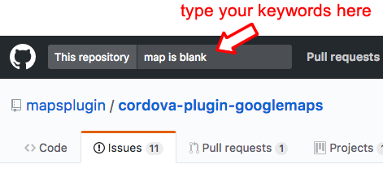
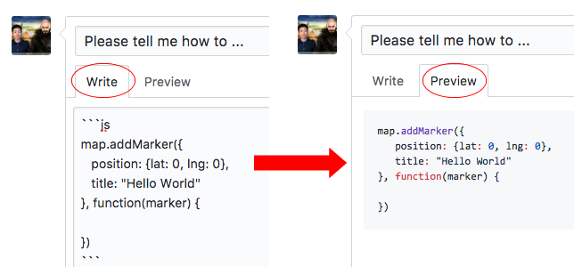
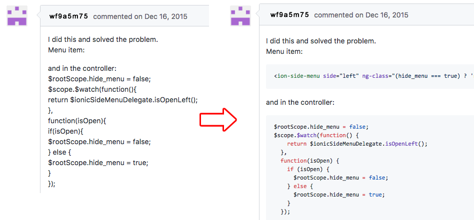

# Please read before asking your question or issue

Hi, thank you for using the cordova-googlemaps-plugin.

If you find yourself here, you may have some issues using this plugin.
I would like to help you solve your issues as well as improve this plugin as much as possible.
But in order to do this, I also need your help as much as possible. Please read below in an effort to effectively accomplish this.

-------

## 1. Search the past issues

Before submitting an issue or question, please search for past issues using the search box on the [mapsplugin page](https://github.com/mapsplugin/cordova-plugin-googlemaps).



Usually you will probably find similar questions along with answers and/or resolutions regarding the exact same issue that you are experiencing.


-------

## 2. Question about your code? Please beautify your code.

When you paste your code, please use **triple-backticks**. The readability matters more than you may think.

If you specify your code language (js, css, html ...etc), Github will color your code automatically which greatly enhances readability.



And also, please format your code for readability also. You can beautify your JS code at http://jsbeautifier.org/



-------

## 3. Which version do you use?

The important thing is **which version of this plugin do you use?**

This is imperative because this plugin is updated frequently.
Please include your minor version as well.

```
$ cordova plugin list
com.googlemaps.ios 2.3.0 "Google Maps SDK for iOS"
cordova-plugin-googlemaps 2.0.0-beta2-20170714-1033 "cordova-plugin-googlemaps"
                          ^^^^^^^^^^^^^^^^^^^^^^^^^
                          Please include the plugin minor version
```

-------

## 4. Take a screenshot or screen recording

In order to understand your issue, please take a screenshot or preferably a screen recording(video).

If you do not know how to do this:

### Android

**Screenshot**

```shell
$> adb shell screencap -p /sdcard/capture.png

$> adb pull /sdcard/capture.png ./
```

**Screen recording**

```shell
$> adb shell screenrecord /sdcard/capture.mp4

$> adb pull /sdcard/capture.mp4 ./
```

### iOS

- [How to use QuickTime to create a screen recording](https://www.tekrevue.com/tip/record-iphone-screen-quicktime/)

Then you can upload the video to Youtube, or convert it to a git animation.
This is really beneficial, to everyone, when trying to understand what you may be trying to explain. There may be certain cues as well.

-------

## 5. Save the logs

When your application crashes for whatever reason, the Android and/or iOS development environments will usually reveal the reason in the native logs.
Please save the logs via `adb` or `xcode`.

This is highly beneficial as well in helping point out the problem in most cases..

-------

## 6. Provide your code

In order to reproduce your issue, we ask that you share your project files.

Sharing your project files will help me solve your problem a LOT sooner.

Please share your project files on a git repository service like [Github](https://github.com) or [BitBucket](https://bitbucket.org).

**Bitbucket allows you to make a private git repository for free**.
You can easily share your project files with only me (wf9a5m75@gmail.com).
If you are not very familiar with using the git repository, please watch this video.
https://www.youtube.com/watch?v=BtEvnE79jxY

### Do you need a NDA? We can do it.

If you need to sign up for a NDA, please let us know.

**Please DO NOT send us a zip file.**


-------

## 7. Don't send us an email regarding an issue.

Some people send us questions regarding code issues via E-mail.

We appreciate it if you submit an issue right here on github first and foremost. This helps everyone as this is a large project. A lot of issues have already been covered, fixed, or documented with complete explanations in the past. The posting of every detail is essential because of the variability in use cases, devices (and versions), platforms (and versions), and other plugins (and versions).


--------

## 8. Feature request


If you (or your company) have a feature request, please contact us.
Private support may be available at a negotiable cost.

Please do not send us your code right away.

