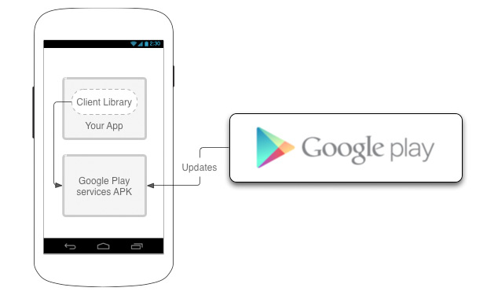

[TroubleShootings](../README.md) > Conflicting with other plugins

# Conflicting with other plugins

You can not build your application because this plugin conflict with other ones.

You might see similar build error logs like below.


``` bash
$ cordova run android

...
Found com.google.android.gms:play-services-maps:12.0.1, but version 11.6.2 is needed for the google-services plugin.
Found com.google.android.gms:play-services-location:12.0.1, but version 11.6.2 is needed for the google-services plugin.
:app:processDebugGoogleServices FAILED

FAILURE: Build failed with an exception.

* What went wrong:
Execution failed for task ':app:processDebugGoogleServices'.
> Please fix the version conflict either by updating the version of the google-services plugin (information about the latest version is available at https://bintray.com/android/android-tools/com.google.gms.google-services/) or updating the version of com.google.android.gms to 11.6.2.

* Try:
Run with --stacktrace option to get the stack trace. Run with --info or --debug option to get more log output.

* Get more help at https://help.gradle.org

BUILD FAILED in 8s
21 actionable tasks: 1 executed, 20 up-to-date
(node:4142) UnhandledPromiseRejectionWarning: Error: /Users/user/Sites/app/platforms/android/gradlew: Command failed with exit code 1 Error output:
FAILURE: Build failed with an exception.

* What went wrong:
Execution failed for task ':app:processDebugGoogleServices'.
> Please fix the version conflict either by updating the version of the google-services plugin (information about the latest version is available at https://bintray.com/android/android-tools/com.google.gms.google-services/) or updating the version of com.google.android.gms to 11.6.2.

* Try:
Run with --stacktrace option to get the stack trace. Run with --info or --debug option to get more log output.

* Get more help at https://help.gradle.org

BUILD FAILED in 8s
    at ChildProcess.whenDone (/Users/user/Sites/app/platforms/android/cordova/node_modules/cordova-common/src/superspawn.js:169:23)
    at ChildProcess.emit (events.js:160:13)
    at maybeClose (internal/child_process.js:943:16)
    at Process.ChildProcess._handle.onexit (internal/child_process.js:220:5)
(node:4142) UnhandledPromiseRejectionWarning: Unhandled promise rejection. This error originated either by throwing inside of an async function without a catch block, or by rejecting a promise which was not handled with .catch(). (rejection id: 1)
(node:4142) [DEP0018] DeprecationWarning: Unhandled promise rejections are deprecated. In the future, promise rejections that are not handled will terminate the Node.js process with a non-zero exit code.
```

------------------------------------------------------------------------

## Reason

Google provides a common library called `Google Play Services`, which is external library that is able to update from Google without reinstalling your application.

For example, Google Play Services library contains Google Maps API for Android.
Application cau use it through Google Play Services SDK.



**One application contains one version of Google Play SDK.**

Conflicting occurs when one of plugins you installed requests older version of Google Play Services SDK, but the `cordova-plugin-googlempas` requests different version.

You need to specify the same version for all plugins.

------------------------------------------------------------------------

## What version number should you specify?

Google keeps backward compatibility for Google Play Services.

If one plugin requests older version, but another plugin requests newer version, both plugins work on newer version without any problem typically.
(If it does not work, ask to the plugin developer.)

So, specifying the latest version of Google Play Services is better for most case.

https://developers.google.com/android/guides/releases

------------------------------------------------------------------------

## Solution 1: specify the version of Google Play Services SDK

Most plugins provides `variable` when you install the plugin.

For example, you can specify `PLAY_SERVICES_VERSION` variable for the `cordova-plugin-googlemaps`.

```
$> cordova plugin add cordova-plugin-googlemaps \
  --variable API_KEY_FOR_ANDROID="..." \
  --variable API_KEY_FOR_IOS="..." \
  --variable PLAY_SERVICES_VERSION="15.0.1"
```

The other plugin examples:

```
// phonegap-plugin-push
$> cordova plugin add phonegap-plugin-push \
  --variable FCM_VERSION=15.0.1"

// cordova-background-geolocation-lt
$> cordova plugin add cordova-background-geolocation-lt \
  --variable LICENSE="..." \
  --variable GOOGLE_API_VERSION="15.0.1"
```

If you already install them, you need to reinstall all plugins with proper variables.

------------------------------------------------------------------------


## Solution 2: modify the build configure files

Some cordova plugin developer do not provide any optional variable.
In this case, you need to modify the build configure files.

**Step 1. Open the `platforms/android/project.properties` file.**

You will see like this:

(before)
```
target=android-26
android.library.reference.1=CordovaLib
android.library.reference.2=app
cordova.gradle.include.1=cordova-plugin-googlemaps/starter-tbxml-android.gradle
cordova.system.library.1=com.google.android.gms:play-services-maps:12.0.0
cordova.system.library.2=com.google.android.gms:play-services-location:11.0.0
cordova.system.library.3=com.android.support:support-core-utils:24.1.0
cordova.system.library.4=com.google.android.gms:play-services-auth:11.8.0
cordova.system.library.5=com.google.android.gms:play-services-identity:11.8.0
```

Then you need to specify all the same version like below.

```
target=android-26
android.library.reference.1=CordovaLib
android.library.reference.2=app
cordova.gradle.include.1=cordova-plugin-googlemaps/starter-tbxml-android.gradle
cordova.system.library.1=com.google.android.gms:play-services-maps:15.0.1
cordova.system.library.2=com.google.android.gms:play-services-location:15.0.1
cordova.system.library.3=com.android.support:support-core-utils:27.1.1
cordova.system.library.4=com.google.android.gms:play-services-auth:15.0.1
cordova.system.library.5=com.google.android.gms:play-services-identity:15.0.1
```

**Step 2. Open the `platforms/android/app/build.gradle` file.**


(before)
```
dependencies {
  implementation fileTree(dir: 'libs', include: '*.jar')
  // SUB-PROJECT DEPENDENCIES START
  implementation(project(path: ":CordovaLib"))
  compile "com.google.android.gms:play-services-maps:12.0.1"
  compile "com.google.android.gms:play-services-location:12.0.1"
  compile "com.android.support:support-core-utils:24.1.0"
  compile "com.google.android.gms:play-services-auth:11.8.0"
  compile "com.google.android.gms:play-services-identity:11.8.0"
  // SUB-PROJECT DEPENDENCIES END
}
```

Then you need to specify all the same version like below.

```
dependencies {
  implementation fileTree(dir: 'libs', include: '*.jar')
  // SUB-PROJECT DEPENDENCIES START
  implementation(project(path: ":CordovaLib"))
  compile "com.google.android.gms:play-services-maps:15.0.1"
  compile "com.google.android.gms:play-services-location:15.0.1"
  compile "com.android.support:support-core-utils:27.1.1"
  compile "com.google.android.gms:play-services-auth:15.0.1"
  compile "com.google.android.gms:play-services-identity:15.0.1"
  // SUB-PROJECT DEPENDENCIES END
}
```


**Step 3. remove caches**

```
$> cordova clean
```


**Step 4. build again**

```
$> cordova build android
```
