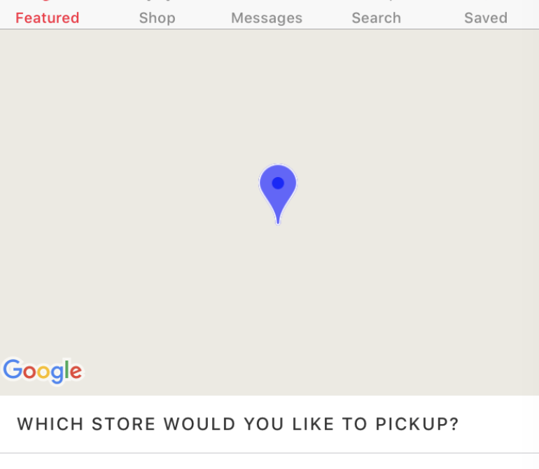

[TroubleShootings](../README.md) > Gray map

# Gray map

You can only see the Google logo.

## Reason

Your API key does not allow to use `Google Maps Android API` or `Google Maps SDK for iOS`.

Since the `cordova-plugin-googlemaps` uses `Google Maps Android API` and `Google Maps SDK for iOS`, you need to generate API keys for `Android application` and `iOS application`.

## Common mistakes

- You only enable Google Maps JavaScript API v3.
- You don't enable Google Maps Android API or Google Maps SDK for iOS.
- You contains unnecessary charactors, such as space.
- You generated API keys before enabling API keys.

## Solution

- Enable `Google Maps Android API` and `Google Maps SDK for iOS`,
then regenerate API keys.

- Please follow this tutorials. https://github.com/mapsplugin/cordova-plugin-googlemaps-doc/blob/master/v2.3.0/api_key/README.md
