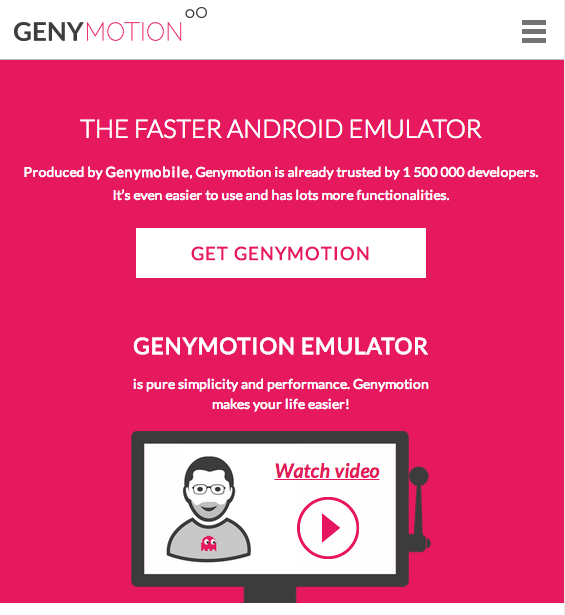

If you want to run your application with this plugin on Android emulator, I recommend you use [Genymotion](http://www.genymotion.com/).

Genymotion is very high performance Android Emulator, works on Windows and Mac OS X, and it's free.

### 1. Download a Genymotion for your platform.

### 2. Install the Genymotion with Virtual Box.

### 3. Follow this tutorial
http://www.techrepublic.com/article/pro-tip-install-google-play-services-on-android-emulator-genymotion/

### 4. Your app should work!
