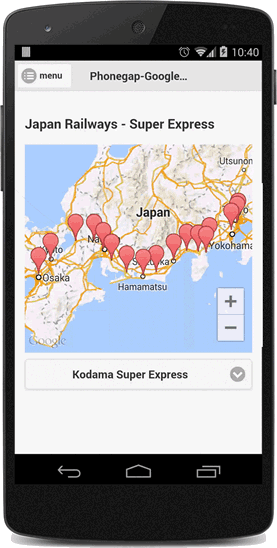

This page explains how to categorize markers with event listener.
This example uses [Marker](../class/Marker/README.md), but [Polyline](../class/Polyline/README.md), [Polygon](../class/Polygon/README.md), [Circle](../class/Circle/README.md), [GroundOverlay](../class/GroundOverlay/README.md), and [TileOverlay](../class/TileOverlay/README.md) also work with the same idea.

## Base idea
In order to categorize markers, this example uses custom event.
The below code is simple example. The infoWindow is opened when you click a button.
The `trigger` and `addEventListener` methods are inherited from [BaseClass](../class/BaseClass/README.md).
```js
map.addMarker({
  position: ...
}, function(marker) {
  // (2) The "MY_EVENT" happened, open the InfoWindow
  map.addEventListener("MY_EVENT", function(message) {
    marker.setTitle(message);
    marker.showInfoWindow();
  });
});

// (1) Button is clicked, then fire the "MY_EVENT".
button.addEventListener("click", function() {
  map.trigger("MY_EVENT", "My message");
});
```

## Categorize your markers
You can add multiple event listeners for one event.
In the below example code, when the "category_change" event occurs, check the category property: "nozomi", "hikari" or "kodama", then if the value equals with "1", the marker is displayed.

```js
var selectDom = document.getElementById("categorySelector");
selectDom.addEventListener("change", function() {
  var category = selectDom.options[selectDom.selectedIndex].value;
  map.trigger("category_change", category);
});

var stationList = [
  {"latlng":[35.681382,139.766084],name:"Tokyo Station", nozomi : 1, hikari : 1, kodama : 1},
  {"latlng":[35.630152,139.74044],name:"Shinagawa Station", nozomi : 1, hikari : 1, kodama : 1},
  {"latlng":[35.507456,139.617585],name:"Shin-Yokohama Station", nozomi : 1, hikari : 1, kodama : 1},
  {"latlng":[35.25642,139.154904],name:"Odawara Station", nozomi : 0, hikari : 1, kodama : 1},
  {"latlng":[35.103217,139.07776],name:"Atami Station", nozomi : 0, hikari : 1, kodama : 1},
  {"latlng":[35.127152,138.910627],name:"Mishima Station", nozomi : 0, hikari : 1, kodama : 1},
  {"latlng":[35.142015,138.663382],name:"Shin-Fuji Station", nozomi : 0, hikari : 0, kodama : 1},
  {"latlng":[34.97171,138.38884],name:"Shizuoka Station", nozomi : 0, hikari : 1, kodama : 1},
  {"latlng":[34.769758,138.014928],name:"Kakegawa Station", nozomi : 0, hikari : 0, kodama : 1},
  {"latlng":[34.703741,137.734442],name:"Hamamatsu Station", nozomi : 0, hikari : 1, kodama : 1},
  {"latlng":[34.762811,137.381651],name:"Toyohashi Station", nozomi : 0, hikari : 1, kodama : 1},
  {"latlng":[34.96897,137.060662],name:"Mikawa-Anjyo Station", nozomi : 0, hikari : 0, kodama : 1},
  {"latlng":[35.170694,136.881637],name:"Nagoya Station", nozomi : 1, hikari : 1, kodama : 1},
  {"latlng":[35.315705,136.685593],name:"Gifu-Hashima Station", nozomi : 0, hikari : 1, kodama : 1},
  {"latlng":[35.314188,136.290488],name:"Yonehara Station", nozomi : 0, hikari : 1, kodama : 1},
  {"latlng":[34.985458,135.757755],name:"Kyoto Station", nozomi : 1, hikari : 1, kodama : 1},
  {"latlng":[34.73348,135.500109],name:"Shin-Osaka Station", nozomi : 1, hikari : 1, kodama : 1}
];

var bounds = stationList.map(function(info) {
  var latLng = new plugin.google.maps.LatLng(info.latlng[0], info.latlng[1]);
  map.addMarker({
    "position": latLng,
    "title": info.name
  }, function(marker) {
    map.on("category_change", function(category) {
      marker.setVisible(info[category] ? true : false);
    });
  });
  return latLng;
});

map.moveCamera({
  "target": bounds
});
map.trigger("category_change", "kodama");
```



