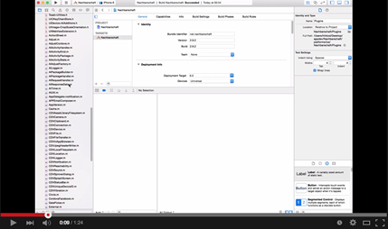

### Android
```
$> cd (your project directory)
$> cordova plugin rm cordova-plugin-googlemaps
$> cordova plugin add cordova-plugin-googlemaps --variable API_KEY_FOR_ANDROID=
$> cordova plugin list
```

### iOS (method 1)
```
$> cordova -v
3.6.3-0.2.13
$> cd (your project directory)
$> cordova plugin rm cordova-plugin-googlemaps
$> rm -rf platforms/ios/(your app)/plugins/com.googlemaps.ios/
$> rm -rf platforms/ios/(your app)/plugins/cordova-plugin-googlemaps/
$> cordova save plugins --experimental
$> cordova platform rm ios
$> cordova platform add ios
$> cordova restore plugins  --experimental
$> cordova plugin add cordova-plugin-googlemaps --variable API_KEY_FOR_IOS=
$> cordova plugin list
```

### iOS (method 2)
@Hirbod figured out a better way to update the plugin. (Thank you so much! :100: )
Check this out!
https://github.com/mapsplugin/cordova-plugin-googlemaps/issues/215

See this simple video:

[](
https://www.youtube.com/watch?v=gr0QrEShPbQ)

https://www.youtube.com/watch?v=gr0QrEShPbQ

**upgrade steps**

1. Open plugins
2. sort by type
3. mark all .m files
4. toggle "target membership" active.
5. Do the same for the frameworks.

You're done!

Will work for all CDVPlugin not Found bugs.
