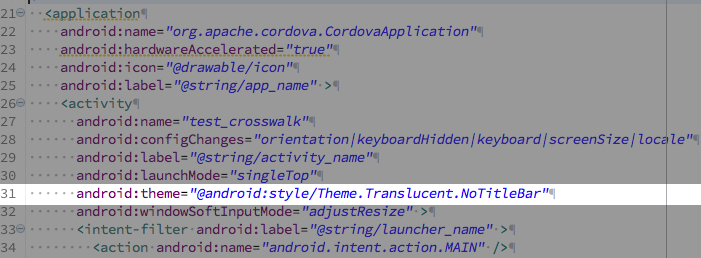

### Information

You need to upgrade our plugin to version 1.3.9 in order to use Crosswalk. We've removed "the old way" and do not support it anymore. Crosswalk 15+ is required!

### 1. Add Crosswalk webview plugin
```bash
cordova plugin add cordova-plugin-crosswalk-webview
```

You can change Crosswalk version inside of your config.xml

### 2. In Crosswalk 16 add line to config.xml

To solve white screen problem add
```xml
<preference name="xwalkZOrderOnTop" value="true" />
```

### 3. Change the AndroidManifest.xml
**ONLY DO THIS STEP IF YOU HAVE A BLACK-SCREEN-PROBLEM, IF NOT, JUST SKIP THAT STEP**
In my tests, it was not necessary to change anything here. I will just keep it here as a "backup" for older devices.

In order to change the background color of the WebView as transparent, you need to modify the application settings **by your hand**.

Open `AndroidManifest.xml`, find `android:theme="@android:style/Theme.Black.NoTitleBar"`, then change to `android:theme="@android:style/Theme.Translucent.NoTitleBar"`.


**Info:**
Before 1.3.9, you had to change ANIMATABLE_XWALK_VIEW. There is no need to change ANIMATABLE_XWALK_VIEW anymore, since it is FALSE by default now. If you use "Native Transition Plugin", they force you to set it to true with `<preference name="CrosswalkAnimatable" value="true" />`. This should not work with our plugin, but you could try it (my test cases were good)


### 4. Build and Run
For Android, just type these commands:
```bash
$> cd HelloMap/
$> cordova build android
```

### Troubleshooting

1) Thus it is not related to this plugin, there is currently a bug with Crosswalk 14+. Please use 15+, as the bug is fixed already. If you can't update and you get something like this

```log
platforms/android/src/org/crosswalk/engine/XWalkCordovaCookieManager.java:22: error: cannot find symbol
import org.xwalk.core.internal.XWalkCookieManager;
```
open ```platforms/android/src/org/crosswalk/XWalkCordovaCookieManager.java``` and change
```java
import org.xwalk.core.internal.XWalkCookieManager;
```
to
```java
import org.xwalk.core.XWalkCookieManager;
```

This will fix the error message on compile.

2) If you have problems with the "Fullscreen" Button staying on top of the map, follow this one:
https://crosswalk-project.org/jira/browse/XWALK-5869
