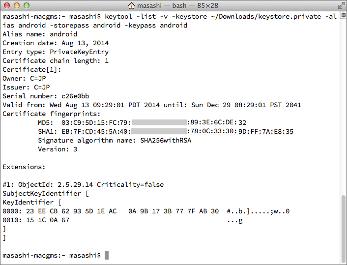
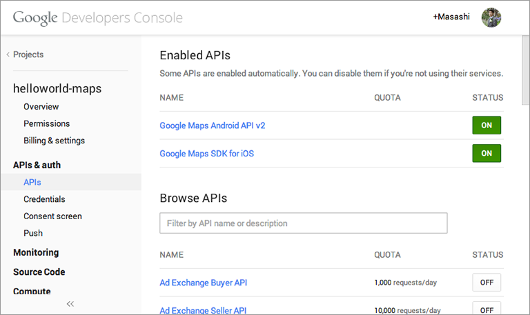
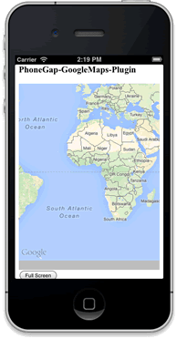

To install this plugin, you need to prepare your API keys for both **Google Maps Android API v2** and **Google Maps iOS SDK**. This tutorial will explain how to obtain the API keys and how to install this plugin. Please follow each step with care.

**Requirement iOS**

Developing an application with the Google Maps SDK for iOS requires the following:

* Cordova CLI 5+
* Xcode 6.4 or later.
* iOS SDK 7.0 or later.

Required XCode Version is 6.4+. The minimum target iOS version for Google Maps SDK for iOS is now 7.0. Version 6.0 is no longer supported. This release requires the following additional dependencies in your project: Accelerate.framework, CoreBluetooth.framework, CoreGraphics.framework, Security.framework

This will be set automatically when you install with CLI.

**Requirement Android**

* Cordova Android 4+, CLI 5+
* minSdkVersion 16 (4.1 is the minimum supported version)


### 0. Requirements
Before getting started you need to set up your environment properly.
* Set the environment path to the **Android SDK Platform-tools* and **Android SDK Build-tools**
* Install [Apache Ant](http://ant.apache.org/)
* Set the JAVA_HOME to the environment path
```bash
$> which ant
/usr/local/bin/ant

$> which android
/android-sdk/tools/android

$> which git
/opt/local/bin/git

$> which unzip
/usr/bin/unzip

$> echo $JAVA_HOME
/System/Library/Java/JavaVirtualMachines/1.6.0.jdk/Contents/Home

$> cordova -v
5.2.0
```

Also you should install the latest versions.


**It's also important to install the Android Support Repository, Library, Play Services and Google Repository.**


### 1. Create a project
```bash
$> cordova create HelloMap com.example.myapp HelloMap
```

### 2. Add platforms
```bash
$> cd HelloMap/
$> cordova platform add android ios
```

### 3. _(Only for Android)_ Displaying the debug certificate fingerprint
* Find the **keytool**.
 * OS X and Linux: ~/.android/

*Display the SHA-1 fingerprint
```bash
keytool -list -v -keystore ~/.android/debug.keystore -alias androiddebugkey -storepass android -keypass android
```


### 4a. Obtain the Google Maps API Key for Android
* Go to [Google APIs Console](https://code.google.com/apis/console/).
* Register your project
* Turn on **Google Maps Android API v2**
* Go to **API Access** page.
* Click [Create New Android Key] button
* In the resulting dialog, enter the SHA-1 fingerprint, then a semicolon, then your application's package name.
* Write down the API Key
See [the official document: Get an Android certificate and the Google Maps API key]

### 4b. Obtain the Google Maps API Key for iOS
* Go to [Google APIs Console](https://code.google.com/apis/console/).
* Register your project
* Turn on **Google Maps SDK for iOS**
* Click [Create new iOS key] button
* Enter one or more bundle identifiers as listed in your application's .plist file(com.example.myapp)
* Write down the API Key
See [the official document: Obtaining an API Key](https://developers.google.com/maps/documentation/ios/start#obtaining_an_api_key)




### 5. Install this plugin

*npm (stable)*
```bash
$> cordova plugin add cordova-plugin-googlemaps --variable API_KEY_FOR_ANDROID="YOUR_ANDROID_API_KEY_IS_HERE" --variable API_KEY_FOR_IOS="YOUR_IOS_API_KEY_IS_HERE"
```

*Github (current master)*
```bash
$> cordova plugin add https://github.com/mapsplugin/cordova-plugin-googlemaps --variable API_KEY_FOR_ANDROID="YOUR_ANDROID_API_KEY_IS_HERE" --variable API_KEY_FOR_IOS="YOUR_IOS_API_KEY_IS_HERE"
```

*In case of PhoneGap, you also need to use the Cordova CLI. Check out [PhoneGap Usage](./Phonegap-Usage).

### 6. Change the www/index.html
```html
<!DOCTYPE html>
<html>
  <head>
    <meta charset="utf-8" />
    <meta name="viewport" content="width=device-width, initial-scale=1">
    <script type="text/javascript" src="cordova.js"></script>
    <script type="text/javascript">
    var map;
    document.addEventListener("deviceready", function() {
      var div = document.getElementById("map_canvas");

      // Initialize the map view
      map = plugin.google.maps.Map.getMap(div);

      // Wait until the map is ready status.
      map.addEventListener(plugin.google.maps.event.MAP_READY, onMapReady);
    }, false);

    function onMapReady() {
      var button = document.getElementById("button");
      button.addEventListener("click", onBtnClicked, false);
    }

    function onBtnClicked() {
      map.showDialog();
    }
    </script>
  </head>
  <body>
    <h3>cordova-googlemaps-plugin</h3>
    <div style="width:100%;height:400px" id="map_canvas"></div>
    <button id="button">Full Screen</button>
  </body>
</html>
```


### 7. Build and Run
For Android, just type these commands:
```bash
$> cordova build android
$> cordova run android
```


If you want to run this plugin on Android Emulator, please read this page.
[Run on Android Emulator](../../../Android-Emulator)

For iOS, you need to install Node.js modules once before running.
```bash
$> npm -g install ios-sim ios-deploy
```

then type these commands:
```bash
$> cordova build ios
$> cordova run ios
```


In order to stop the app, [command] + [D]
