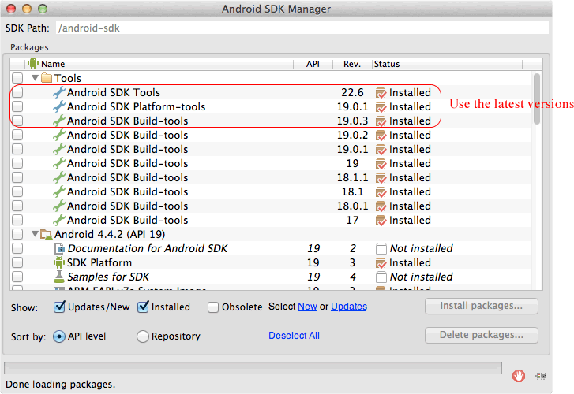
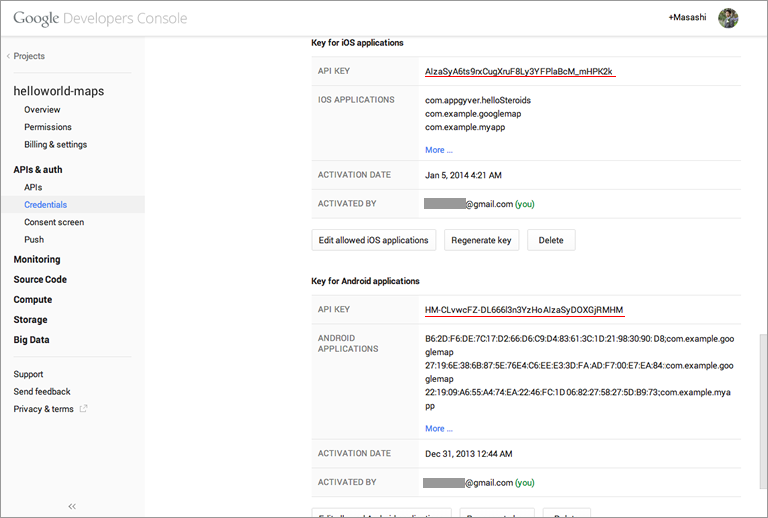
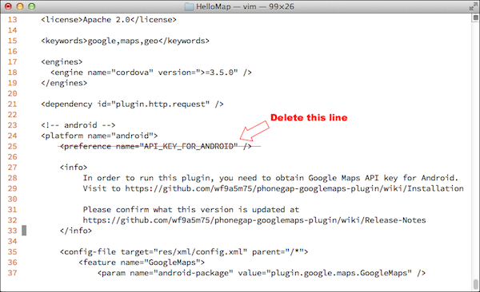

#PhoneGap local install

The cordova-googlemaps-plugin, gives you the ability to work with Native maps in your application. The plugin automatically handles access to Google Maps mobile SDKs.

To install this plugin on PhoneGap, you need to prepare your API keys for both Google Maps Android API v2 and Google Maps iOS SDK. The below tutorial explains how to obtain the API keys, and how to install this plugin. Please follow each steps.

### 0. Requirements
Before getting started you need to set up your environment properly.

Set the environment path to the Android SDK Platform-tools* and **Android SDK Build-tools
Install [Apache Ant](http://ant.apache.org/)
Set the JAVA_HOME to the environment path.

```bash
$> which ant
/usr/local/bin/ant

$> which android
/android-sdk/tools/android

$> which git
/opt/local/bin/git

$> which unzip
/usr/bin/unzip

$> echo $JAVA_HOME
/System/Library/Java/JavaVirtualMachines/1.6.0.jdk/Contents/Home

$> phonegap -v
3.6.0-0.21.19
```

Also you should install the latest versions.


### 1. Create a project
```bash
$> phonegap create HelloMap com.example.map HelloMap
```

### 2. Add platforms
In order to add Android and iOS platforms, you need to build at once.
```bash
$> cd HelloMap/
$> phonegap build android
$> phonegap build ios
```


### 3. _(Only for Android)_ Displaying the debug certificate fingerprint
* Find the **keytool**.
 * OS X and Linux: ~/.android/

*Display the SHA-1 fingerprint
```bash
keytool -list -v -keystore ~/.android/debug.keystore -alias androiddebugkey -storepass android -keypass android
```


### 4a. Obtain the Google Maps API Key for Android
* Go to [Google APIs Console](https://code.google.com/apis/console/).
* Register your project
* Turn on **Google Maps Android API v2**
* Go to **API Access** page.
* Click [Create New Android Key] button
* In the resulting dialog, enter the SHA-1 fingerprint, then a semicolon, then your application's package name.
* Write down the API Key
See [the official document: Get an Android certificate and the Google Maps API key]

### 4b. Obtain the Google Maps API Key for iOS
* Go to [Google APIs Console](https://code.google.com/apis/console/).
* Register your project
* Turn on **Google Maps SDK for iOS**
* Click [Create new iOS key] button
* Enter one or more bundle identifiers as listed in your application's .plist file(com.example.myapp)
* Write down the API Key
See [the official document: Obtaining an API Key](https://developers.google.com/maps/documentation/ios/start#obtaining_an_api_key)





### 5. Install this plugin
Unlike Apache Cordova, the PhoneGap CLI does not accept the `--variable` parameter.
In order to install the plugin, download the [cordova-plugin-googlemaps.zip](https://github.com/mapsplugin/cordova-plugin-googlemaps/archive/master.zip), then extract it.

You need to modify the `plugin.xml` file.
Open the `plugin.xml` with your text editor.

Find and delete the two lines:
 `<preference name="API_KEY_FOR_ANDROID" />` and `<preference name="API_KEY_FOR_IOS" />`


And find and replace `$API_KEY_FOR_ANDROID` and `$API_KEY_FOR_IOS` with your API keys.


Then save the plugin.xml.


After that, you can install the plugin.
```bash
$> phonegap local plugin add (path to the plugin)/cordova-plugin-googlemaps-master/
```


### 6. Change the www/index.html
```html
<!DOCTYPE html>
<html>
  <head>
    <meta charset="utf-8" />
    <meta name="viewport" content="width=device-width, initial-scale=1">
    <script type="text/javascript" src="cordova.js"></script>
    <script type="text/javascript">
    var map;
    document.addEventListener("deviceready", function() {
      var div = document.getElementById("map_canvas");

      // Initialize the map view
      map = plugin.google.maps.Map.getMap(div);

      // Wait until the map is ready status.
      map.addEventListener(plugin.google.maps.event.MAP_READY, onMapReady);
    }, false);

    function onMapReady() {
      var button = document.getElementById("button");
      button.addEventListener("click", onBtnClicked, false);
    }

    function onBtnClicked() {
      map.showDialog();
    }
    </script>
  </head>
  <body>
    <h3>cordova-googlemaps-plugin</h3>
    <div style="width:100%;height:400px" id="map_canvas"></div>
    <button id="button">Full Screen</button>
  </body>
</html>
```

### 7. Run on your device
```bash
$> phonegap run android
$> phonegap run ios
```

