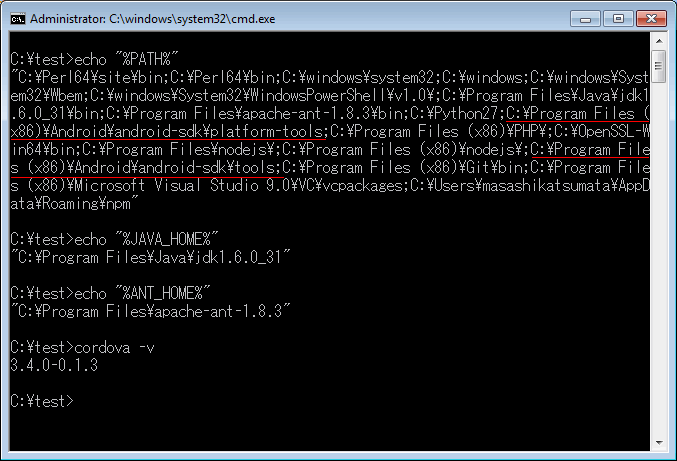
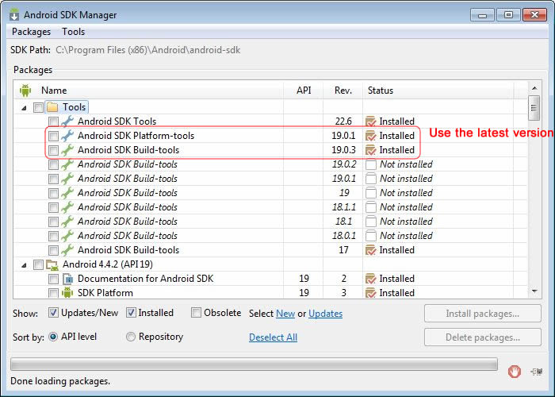
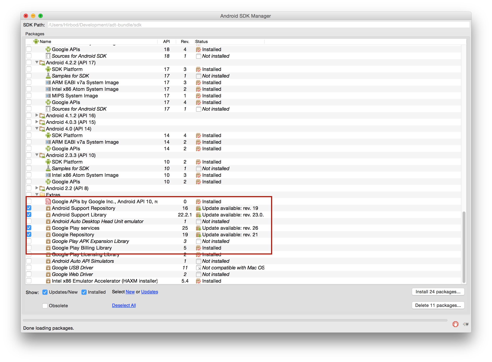
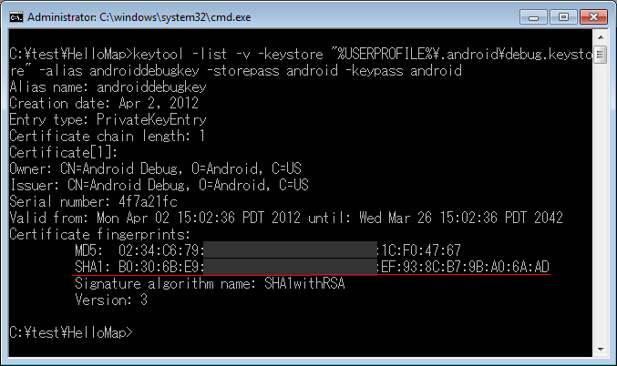
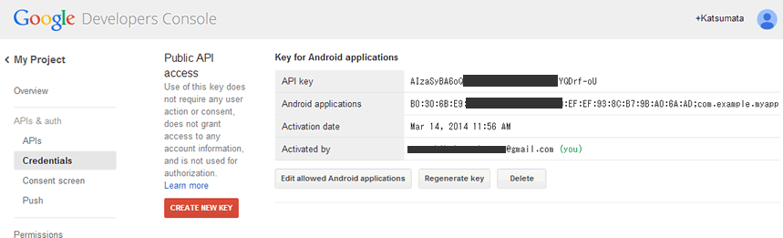

With the cordova-googlemaps-plugin, you can add a map into your application.
The plugin automatically handles access to Google Maps mobile SDKs.

To install this plugin, you need to prepare your API keys for both **Google Maps Android API v2** and **Google Maps iOS SDK**.
But you **can not** create iOS application on Windows.

**Requirement for Android**

* Cordova Android version 4+, Cordova CLI 5+
* minSdkVersion 16 (4.1 is the minimum supported version)

The below tutorial explains how to create an Android application, and obtain a Google Maps API Key.


### 0. Make sure
Before getting start this tutorial, please confirm your environment.
* Set the environment path to the **Android SDK Platform-tools* and **Android SDK Build-tools**
* Install [Apache Ant](http://ant.apache.org/)
* Set the JAVA_HOME to the environment path


Also you should install the latest versions of **Android SDK Platform-tools** and **Android SDK Build-tools**.


**It's also important to install the Android Support Repository, Library, Play Services and Google Repository.**


### 1. Create a project
```shell
C:\> mkdir C:\test
C:\> cd test
C:\test> cordova create HelloMap com.example.myapp HelloMap
```

### 2. Add platforms
```shell
C:\test> cd HelloMap
C:\test\HelloMap> cordova platform add android
```

### 3. Displaying the certificate fingerprint

**Remember**: In the following example, we are displaying the **debug** certificate. Be sure to do the same for the keystore you use to sign your app before publishing it.

* Find the **keytool**
 * Windows Vista and Windows 7: C:\Users\your_user_name\.android\

*Display the SHA-1 fingerprint
```shell
C:\test\HelloMap\platforms\android> keytool -list -v -keystore "%USERPROFILE%\.android\debug.keystore" -alias androiddebugkey -storepass android -keypass android
```

or

```shell
C:\Program Files (x86)\Java\[your_jdk_version]\bin> keytool -list -v -keystore "%USERPROFILE%\.android\debug.keystore" -alias androiddebugkey -storepass android -keypass android
```



### 4. Obtain the Google Maps API Key for Android
Go to [Google APIs Console](https://code.google.com/apis/console/), then turn on **Google Maps Android API v2**
* Go to **API Access** page.
* Click [Create New Android Key] button
* In the resulting dialog, enter the SHA-1 fingerprint, then a semicolon, then your application's package name.
* Write down the API Key
See [the official document: Get an Android certificate and the Google Maps API key](https://developers.google.com/maps/documentation/android/start#get_an_android_certificate_and_the_google_maps_api_key)




## 5. Install this plugin
Execute the below command.

*npm (stable)*
```shell
C:\test\HelloMap> cordova plugin add cordova-plugin-googlemaps --variable API_KEY_FOR_ANDROID="YOUR_API_KEY_IS_HERE"
```

*Github (current master)*
```shell
C:\test\HelloMap> cordova plugin add https://github.com/mapsplugin/cordova-plugin-googlemaps --variable API_KEY_FOR_ANDROID="YOUR_API_KEY_IS_HERE"
```

*In case of PhoneGap, you also need to use the Cordova CLI. Check out [PhoneGap Usage](./Phonegap-Usage).
### Using Visual studio (cordova tools)?
Edit your **config.xml** in the root of your proyect and add the following.
```xml
<vs:plugin name="plugin.google.maps">
	<param name="API_KEY_FOR_ANDROID" value="YOUR_API_KEY_IS_HERE" />
	<param name="API_KEY_FOR_IOS" value="YOUR_API_KEY_IS_HERE" />
</vs:plugin>
```
Visual studio will automatically fetch the plugin and configure it with the API keys. (https://msdn.microsoft.com/en-us/library/dn757051.aspx)

### 6. Change the www/index.html
```html
<!DOCTYPE html>
<html>
  <head>
    <meta charset="utf-8" />
    <meta name="viewport" content="width=device-width, initial-scale=1">
    <script type="text/javascript" src="cordova.js"></script>
    <script type="text/javascript">
    var map;
    document.addEventListener("deviceready", function() {
      var div = document.getElementById("map_canvas");

      // Initialize the map view
      map = plugin.google.maps.Map.getMap(div);

      // Wait until the map is ready status.
      map.addEventListener(plugin.google.maps.event.MAP_READY, onMapReady);
    }, false);

    function onMapReady() {
      var button = document.getElementById("button");
      button.addEventListener("click", onBtnClicked, false);
    }

    function onBtnClicked() {
      map.showDialog();
    }
    </script>
  </head>
  <body>
    <h3>cordova-googlemaps-plugin</h3>
    <div style="width:100%;height:400px" id="map_canvas"></div>
    <button id="button">Full Screen</button>
  </body>
</html>
```


### 7. Run the code on your device
```shell
C:\test\HelloMap> cordova build android
C:\test\HelloMap> cordova run android
```


If you want to run this plugin on Android Emulator, please read this page.
[Run on Android Emulator](../../../Android-Emulator/README.md)

### If you get "map is null!" error...
This issues occurs because Google Maps Android API v2 uses Google Play Services library which provides as isolated APK.

Install the below apk.
https://play.google.com/store/apps/details?id=com.google.android.gms

For more detail, refer the stack overflow
[Running Google Maps v2 on the Android emulator](http://stackoverflow.com/questions/14040185/running-google-maps-v2-on-the-android-emulator)

### What's next?
There are many features! Check out the wiki page:
https://github.com/mapsplugin/cordova-plugin-googlemaps/wiki
