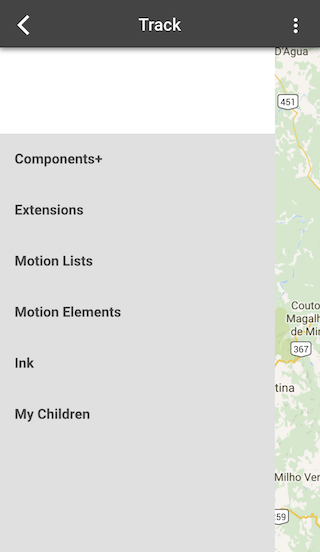

When using a Ionic's `<ion-side-menus>`, the map will be overlayed by the side menu as shown below.

## The Solution:

To overcome this, the `<ion-side-menus>` visibility should be set to "hidden".

First of all, in the controller of the side-menu, add the following:

`$rootScope.side_menu = document.getElementsByTagName("ion-side-menu")[0];`

     $rootScope.$on('$stateChangeSuccess', function (event, toState, toParams, fromParams, toParams) {
        if (toState.name != <MAPS_STATENAME>) {
            $rootScope.side_menu.style.visibility = "visible";
        }
    });

Then, add this line in the map's controller:

`$rootScope.side_menu.style.visibility = "hidden";`

ENJOY!
