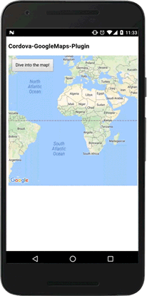
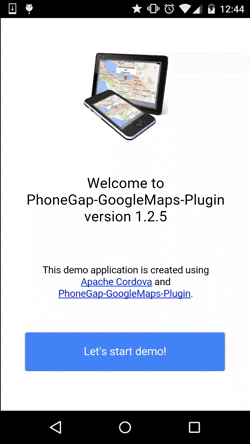

Cordova GoogleMaps plugin for iOS and Android (v1.4.0 - cold version)
==========================
This plugin is a thin wrapper for [Google Maps Android API](https://developers.google.com/maps/documentation/android/) and [Google Maps SDK for iOS](https://developers.google.com/maps/documentation/ios/).
Both [PhoneGap](http://phonegap.com/) and [Apache Cordova](http://cordova.apache.org/) are supported.

-----

### Quick install

Before you install, make sure you've read the [instructions](https://github.com/mapsplugin/cordova-plugin-googlemaps/wiki/Installation)

*npm (current stable 1.4.0)*
```bash
$> cordova plugin add cordova-plugin-googlemaps --variable API_KEY_FOR_ANDROID="YOUR_ANDROID_API_KEY_IS_HERE" --variable API_KEY_FOR_IOS="YOUR_IOS_API_KEY_IS_HERE"
```

*Github (current master, potentially unstable)*
```bash
$> cordova plugin add https://github.com/mapsplugin/cordova-plugin-googlemaps --variable API_KEY_FOR_ANDROID="YOUR_ANDROID_API_KEY_IS_HERE" --variable API_KEY_FOR_IOS="YOUR_IOS_API_KEY_IS_HERE"
```

If you re-install the plugin, please always remove the plugin first, then remove the SDK

```bash
$> cordova plugin rm cordova-plugin-googlemaps
$> cordova plugin rm com.googlemaps.ios
$> cordova plugin add cordova-plugin-googlemaps --variable API_KEY_FOR_ANDROID="YOUR_ANDROID_API_KEY_IS_HERE" --variable API_KEY_FOR_IOS="YOUR_IOS_API_KEY_IS_HERE"
```

The SDK-Plugin won't be uninstalled automatically and you will stuck on an old version.


### Last release information

**v1.4.0 - 04/Nov/2016 (cold version)**
- Lots of bugs are fixed.
- Improve performance (especially adding markers using the same url)
- Updated Google Maps SDK for iOS to 2.1.1
- StyledMapType is available.


### Quick demo


```html
<script type="text/javascript">
var map;
document.addEventListener("deviceready", function() {
  var div = document.getElementById("map_canvas");

  // Initialize the map view
  map = plugin.google.maps.Map.getMap(div);

  // Wait until the map is ready status.
  map.addEventListener(plugin.google.maps.event.MAP_READY, onMapReady);
}, false);

function onMapReady() {
  var button = document.getElementById("button");
  button.addEventListener("click", onBtnClicked);
}

function onBtnClicked() {

  // Move to the position with animation
  map.animateCamera({
    target: {lat: 37.422359, lng: -122.084344},
    zoom: 17,
    tilt: 60,
    bearing: 140,
    duration: 5000
  }, function() {

    // Add a maker
    map.addMarker({
      position: {lat: 37.422359, lng: -122.084344},
      title: "Welecome to \n" +
             "Cordova GoogleMaps plugin for iOS and Android",
      snippet: "This plugin is awesome!",
      animation: plugin.google.maps.Animation.BOUNCE
    }, function(marker) {

      // Show the info window
      marker.showInfoWindow();

      // Catch the click event
      marker.on(plugin.google.maps.event.INFO_CLICK, function() {

        // To do something...
        alert("Hello world!");

      });
    });
  });
}
</script>
```

-----

### Documentation

[All documentations are here!!](wiki.md)

* [Installation](installation/README.md)
  * Automatic Installation
  * Tutorials
    * [Tutorial for Windows](installation/windows/cli/README.md)
    * [Tutorial for Mac/Linux](installation/macosx/README.md)
    * [PhoneGap Usage](installation/phonegap/README.md)
    * [Tutorial for Crosswalk](installation/crosswalk/README.md)
  * Upgrade
    * Just re-install this plugin

* [Terms of Services](Terms-of-Services/README.md)

#### Classes
- [Map](./class/Map/README.md)
- [Marker](./class/Marker/README.md)
- [Circle](./class/Circle/README.md)
- [Polyline](./class/Polyline/README.md)
- [Polygon](./class/Polygon/README.md)
- [Tile Overlay](./class/TileOverlay/README.md)
- [Ground Overlay](./class/GroundOverlay/README.md)
- [Kml Overlay](./class/KmlOverlay/README.md)
- [LatLng](./class/LatLng/README.md)
- [LatLngBounds](./class/LatLngBounds/README.md)
- [CameraPosition](./class/CameraPosition/README.md)
- [Location](./class/Location/README.md)
- [Geocoder](./class/Geocoder/README.md)
- [BaseClass](./class/BaseClass/README.md)
- [External Service](./class/External-Service/README.md)

If you want to use crosswalk, just follow this easy documentation.
[Install Plugin with Crosswalk](installation/crosswalk/README.md)

-----

### Join the official community
New versions will be announced through the official community. Stay tuned!

<a href="https://plus.google.com/u/0/communities/117427728522929652853"></a>

### Chat
Join our online chat at<br>
[](https://gitter.im/nightstomp/cordova-plugin-googlemaps)

### Example
You can see an example here. **(old version, but all most the same)**

 [phonegap-googlemaps-plugin-v1.2.5.apk](top/phonegap-googlemaps-plugin-v1.2.5.apk)
```bash
$> adb install phonegap-googlemaps-plugin-v1.2.5.apk
```


