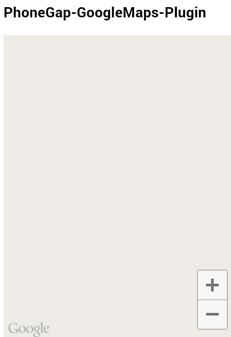
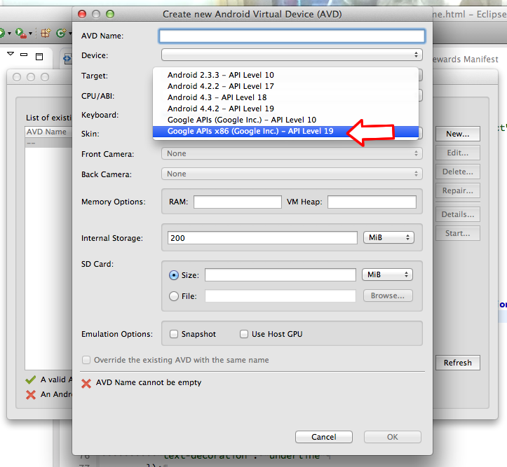
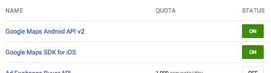
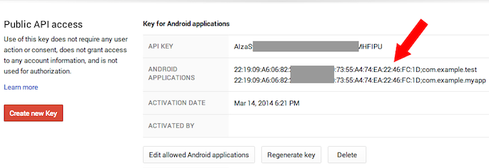
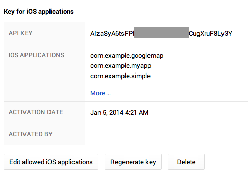
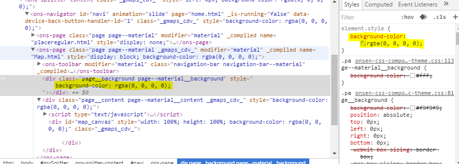

Some people get this error **"Blank Map"** when they try for the first time.



There are several reason. Check the bellow points:
## 1. Do you use Android emulator?
Since this plugin uses Google Maps Android API v2, you need to use "Google APIs x86 (Google Inc.)".


## 2. Did you turn on the switches?
You might forget turning on the switches of **Google Maps Android API v2** and **Google Maps SDK for iOS** at Google APIs Console.


## 3. Is your API key correct?
You need to register your SHA-1 fingerprint to Google APIs console.
Follow the instruction:

- Mac User
```bash
$> keytool -list -v -keystore ~/.android/debug.keystore -alias androiddebugkey -storepass android -keypass android
```
- Windows User
```shell
C:\test\HelloMap\platforms\android> keytool -list -v -keystore "%USERPROFILE%\.android\debug.keystore" -alias androiddebugkey -storepass android -keypass android
```
- Meteor (with cordova) on Linux
```shell
$ keytool -list -v -keystore ~/.meteor/android_bundle/.android/debug.keystore -alias androiddebugkey -storepass android -keypass android
```

## 4. Have you registered your package name with the above sign correctly?


Also check for the iOS setting.


## 5. Using OnsenUI 1/2?
If you are using OnsenUI and get the *plugin.google.maps.event.MAP_READY* event to work but you still don´t see the map, maybe there is a div blocking your native map, the plugin make it best to avoid this blocking div´s (setting the transparency), but sometimes it just can’t handle all scenarios, in that case look for a parent div without the transparency, and set the transparency with CSS/JS. Use chrome inspect devices tool for easy find and fix.



Add `background-color: rgba(0, 0, 0, 0);` to those possible blocking divs.
