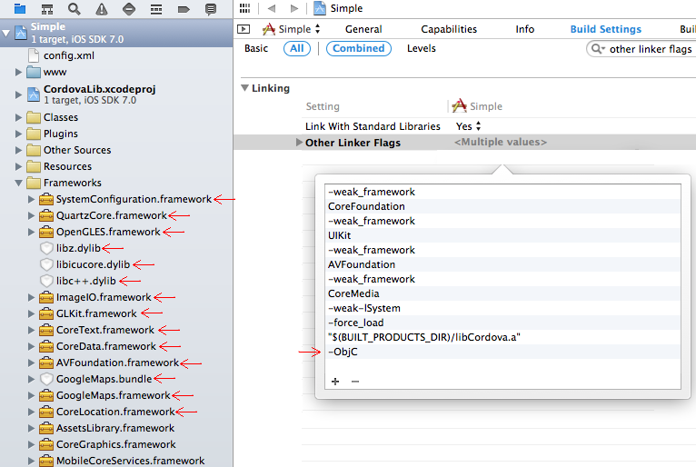

After installing this plugin for iOS, you might get this error.
```
ld: symbol(s) not found for architecture i386
clang: error: linker command failed with exit code 1 (use -v to see invocation)
Showing first 200 notices only

** BUILD FAILED **
```

I don't know why, but it seems the cordova CLI does not work correctly sometimes.
Open the project with Xcode (under the `platforms/ios/***.xcodeproj`),
then confirm the installed frameworks.



If less, try `cordova remove plugin.google.maps` and `cordova add plugin.google.maps` again couple of times.
