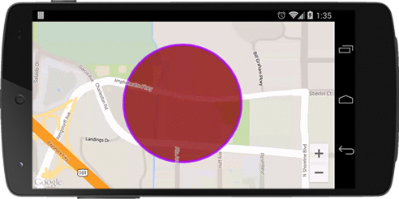
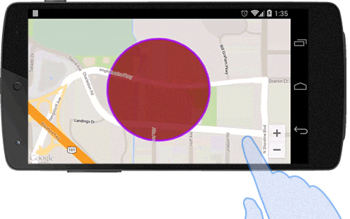

### Add a circle
The **map.addCircle()** method takes a single Circle options object literal, specifying the initial properties of the circle.

The following fields are available when constructing a circle:

Field Name | Type | Description
----|------|----
center | [LatLng](../LatLng/README.md) | The center position.
visible | Boolean | false if you want to hide.
radius | Number | Specify the radius in meter.
strokeColor | String | Specify the border color of the circle. You can specify the [HTML colors](../../Available-HTML-colors/README.md)
strokeWidth | Number | The width of border.
fillColor | String | Specify the inside color of the circle. You can specify the [HTML colors](../../Available-HTML-colors/README.md)
visible | Boolean | Set false if you want to hide.
zIndex | Number | Specify the zIndex.

```js
const GOOGLE = {"lat": 37.422858, "lng": -122.085065};
map.addCircle({
  'center': GOOGLE,
  'radius': 300,
  'strokeColor' : '#AA00FF',
  'strokeWidth': 5,
  'fillColor' : '#880000'
});
```


---

### callback
The **map.addCircle()** method takes a callback function as the second argument.
The callback function is involved when the circle is created on the map.
You can get the instance of the circle from the argument of the callback function.
```js
const GOOGLE = {"lat": 37.422858, "lng": -122.085065};
map.addCircle({
  'center': GOOGLE,
  'radius': 300,
  'strokeColor' : '#AA00FF',
  'strokeWidth': 5,
  'fillColor' : '#880000'
}, function(circle) {

  setTimeout(function() {
    circle.setRadius(600);
  }, 3000);
});
```

---

### Remove the circle
To remove a circle from the map, call the remove() method.

```js
circle.remove();
```

---

### Click Event
You can listen the click event using `OVERLAY_CLICK` event.
```js
const GOOGLE = {"lat": 37.422858, "lng": -122.085065};

map.addCircle({
  'center': GOOGLE,
  'radius': 300,
  'strokeColor' : '#AA00FF',
  'strokeWidth': 5,
  'fillColor' : '#880000'
}, function(circle) {
  circle.on(plugin.google.maps.event.OVERLAY_CLICK, function(overlay) {
    circle.setFillColor("blue");
    circle.setStrokeColor("red");
    circle.setStrokeWidth(10);
  });
});
```


***
# Circle Class Reference
Method | Return value | Description
----|------|----
getCenter() | [LatLng](../LatLng/README.md)  | Return the center position.
getRadius() | Number  | Return the raidus.
getStrokeColor() | String  | Return the stroke color.
getVisible() | Boolean  | Return true if the circle is visible.
getZIndex() | Boolean  | Return zIndex.
remove() | void | Remove the circle.
setCenter([LatLng](../LatLng/README.md)) | void | Set the center position.
setFillColor(String) | void | Set the fill color.
setStrokeColor(String) | void | Set the border color.
setStrokeWidth(Number) | void | Set the border width.
setVisible(Boolean) | void | Set false if you want to hide.
setZIndex(Number) | void | Set the zIndex.
setRadius(Number) | void | Set the radius in meter.
getMap() | [Map](../Map/README.md)  | Return the map instance.
