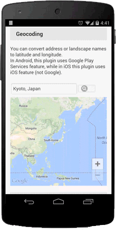
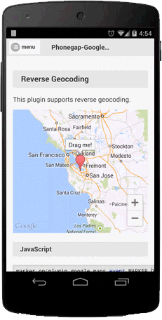

### Geocoding
This plugin supports geocoding. You can convert address or landscape names to latitude and longitude.
In Android, this plugin uses Google Play Services feature, while in iOS this plugin uses iOS feature (not Google).
```js
var request = {
  'address': $("#geocoder_input").val()
};
plugin.google.maps.Geocoder.geocode(request, function(results) {
  if (results.length) {
    var result = results[0];
    var position = result.position;

    map.addMarker({
      'position': position,
      'title':  JSON.stringify(result.position)
    }, function(marker) {

      map.animateCamera({
        'target': position,
        'zoom': 17
      }, function() {
        marker.showInfoWindow();
      });

    });
  } else {
    alert("Not found");
  }
});
```



### Reverse geocoding
This plugin also supports reverse geocoding.
```js
var request = {
  'position': GOOGLE
};
plugin.google.maps.Geocoder.geocode(request, function(results) {
  if (results.length) {
    var result = results[0];
    var position = result.position;
    var address = [
      result.subThoroughfare || "",
      result.thoroughfare || "",
      result.locality || "",
      result.adminArea || "",
      result.postalCode || "",
      result.country || ""].join(", ");

    map.addMarker({
      'position': position,
      'title':  address
    });
  } else {
    alert("Not found");
  }
});
```

