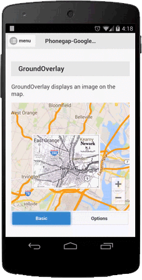
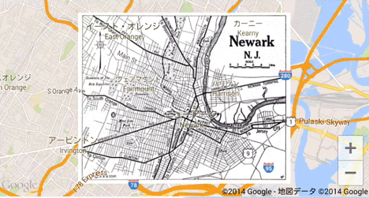

### Add a GroundOverlay
A ground overlay is an image that is fixed to a map. To add an image, call addGroundOverlay() method.
The **map.addGroundOverlay()** method takes a single overlay options object literal, specifying the initial properties of the ground overlay.

The following fields are available when constructing a ground overlay:

Field Name | Type | Description
----|------|----
url | String | The url of the image. You can use one of the following protocol: `http`, `https`, `file`, `cdvfile` and the file absolute path. (Android also accepts `file:///android_asset/`)
bounds | Array.[LatLng](../LatLng/README.md) | Array of LatLng for display the ground overlay.
visible | Boolean | false if you want to hide the ground overlay. (Default: true)
opacity | Number | Opacity of the ground overlay. Specify the number between 0.0 - 1.0  (Default: 1.0)
bearing | Number | The angle of the image. (Default: 0)
zIndex | Number | Specify the zIndex. (Default: 1)

```js
var bounds = [
  {"lat": 40.712216, "lng": -74.22655},
  {"lat": 40.773941, "lng": -74.12544}
];

map.addGroundOverlay({
  'url': "http://www.lib.utexas.edu/maps/historical/newark_nj_1922.jpg",
  'bounds': bounds,
  'opacity': 0.5
}, function(groundOverlay) {
  map.showDialog();
  map.animateCamera({
    'target': bounds
  });
});
```


### Bearing
You can change the bearing using **setBearing()** method
```js
map.addGroundOverlay({
  'url': "http://www.lib.utexas.edu/maps/historical/newark_nj_1922.jpg",
  'bounds': bounds
}, function(groundOverlay) {

  // Add event listener
  map.on("BEARING_CHANGE", function(value) {
    groundOverlay.setBearing(value);
  });

});

$("#bearingRange").change(function() {
  var value = $(this).val();
  map.trigger("BEARING_CHANGE", value);
});
```



### Click Event
```js
map.addGroundOverlay({
  'url': "http://www.lib.utexas.edu/maps/historical/newark_nj_1922.jpg",
  'bounds': bounds
}, function(groundOverlay) {

  map.on(plugin.google.maps.event.OVERLAY_CLICK, function(overlay, latLng) {
    alert("Clicked");
  });

});
```

***
# GroundOverlay Class Reference
Method | Return value | Description
----|------|----
setBearing(Number) | void | Set the bearing of the ground overlay (the direction that the vertical axis of the ground overlay points) in degrees clockwise from north.
getBearing() | Number | Return the bearing of the ground overlay in degrees clockwise from north.
setOpacity(Number) | void | Change the marker opacity. (0.0 - 1.0)
getOpacity() | Number | Return the marker opacity.
setVisible(Boolean) | void  | Set false if you want to hide the ground overlay.
getVisible() | Boolean  | Return true if the ground overlay is visible
setImage(String) | void  | Change the image url of the ground overlay.
remove() | void  | Remove the ground overlay.
getMap() | [Map](../Map/README.md)  | Return the map instance.
