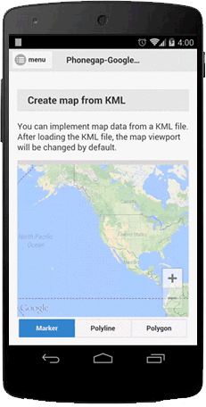

### Add a KmlOverlay
`map.addKmlOverlay()` adds geographic markup onto the map from a KML file.
You can specify the file using one of the following protocols: `http`, `https`, `file`, `cdvfile` or the file absolute path.
Only Android, also accepts `file:///android_asset/`.
The added overlays are clickable.

**PhoneGap-GoogleMaps-Plugin can parse only Polyline, Polygon, and Markers currently**


Field Name | Type | Description
----|------|----
url | String | The url of the kml file (file path or network url)
preserveViewport | Boolean | Set true if prevent the camera animation after overlays are added. (Default: false)
animation | Boolean | Set false if you want to change the camera view without animation. (Default: true)

```js
map.addKmlOverlay({
  'url': "www/polygon.kml"
}, function(kmlOverlay) {
  kmlOverlay.on(plugin.google.maps.event.OVERLAY_CLICK, function(overlay) {
    if (overlay.type === "Polygon") {
      overlay.setFillColor("red");
    }
    if (overlay.type === "Polyline") {
      overlay.setColor("blue");
    }
    if (overlay.type === "Marker") {
      overlay.showInfoWindow();
    }
  });
});
```


***
# KmlOverlay Class Reference
Method | Return value | Description
----|------|----
getMap() | [Map](../Map/README.md)  | Return the map instance.
remove() | void  | Remove the kml overlay.
getOverlays() | Array.&lt;[Polyline](../Polyline/README.md) &#124; [Polygon](../Polygon/README.md) &#124; [Marker](../Marker/README.md)&gt; | Return the overlays that loaded from KML file.
