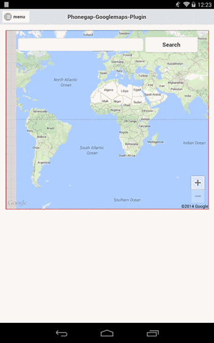
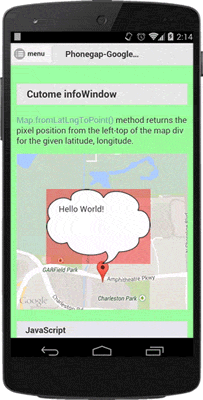
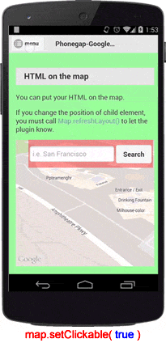
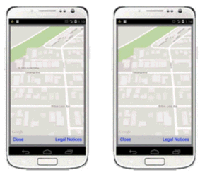
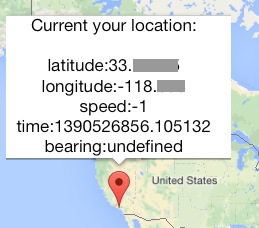

* [Check the availability of the map](./isAvailable/README.md)
* [Implement the legal notice](./getLicenseInfo/README.md)

### Important notice
Since plugin version 1.3.3, we will check if the StatusBar Plugin is installed, and substract -20px from the map-height and also move the y-offset by -20px. This will not affect you when you're using StatusBar with default settings, but it will affect you, when you set `StatusBar.overlaysWebView(false)`

To fix this 20px white bottom problem, just add 20 extra pixels to your #map_canvas (with jQuery or vanilla js)

I do something like this
```js
// default (when overlayed)
$('#map_canvas').css('height', $('.ons-page-inner:last').height());
// when not overlayed
$('#map_canvas').css('height', $('.ons-page-inner:last').height() + 20);
```

Please ignore my ons-page-inner, this is just an example (im my case, I need exactly the height of ons-page-inner)

### Create a map
First of all, you need to initialize the map **after the deviceready** event.
[`plugin.google.maps.Map.getMap()`](./getMap/README.md) is a static method.
Since this plugin provides singleton map, if a map was not created, it will return the map, and if a map was created, it will return the map instance.

**You can not create multiple maps currently. (and near future)**

```js
document.addEventListener("deviceready", function() {
  // Define a div tag with id="map_canvas"
  var mapDiv = document.getElementById("map_canvas");

  // Initialize the map plugin
  var map = plugin.google.maps.Map.getMap(mapDiv);

  // You have to wait the MAP_READY event.
  map.on(plugin.google.maps.event.MAP_READY, onMapInit);
});

function onMapInit(map) {
}
```


*Related pages*
* [Create a map with initialize options](./getMap/README.md)
* [Check the availability of the map](./isAvailable/README.md)
* [Show a map with full screen](./showDialog/README.md)

----

### How does the plugin work?
As of version 1.2.0, you can put any HTML element on top of the map.
You need to understand how this works.

The map is a native view, not related to JavaScript.
It means the map and the browser are different views, the map is not rendered inside the browser view, such as HTML.

In order to put HTML content on top of the map, the map places itself under the browser-view.
HTML background of every single parent node must be transparent (`rgba(0,0,0,0)`); the plugin changes this automatically for you. Keep in mind that absolute positioned elements with width and height set to 100% will not be recognized as parent-nodes (when there are not wrapped around the map) and need to set to transparent manually. Please use the search function for more infos.

If you want to change the background color of your app, use [`map.setBackgroundColor()`](./setBackgroundColor/README.md).


----

### Put HTML elements on the map
You can put any HTML element on top of the map, such as buttons and input field.
The html elements inside of the map_canvas `<div id="map_cavas"><element></el></div>` will change theire position with the map, the plugin will watch for it. (not when you touch, but when you move it with CSS, or a push-menu etc)
```html
<div id="map_canvas">
  <div id="searchBox">
    <input type="text" id="query" size="30" />
    <button id="searchBtn">Search</button>
  </div>
</div>
```
Example:



---
### map.setDebuggable()
`map.setDebuggable( true )` allows you to confirm where is the clickable regions visually.



---
### map.setClickable()
If you want to show your HTML above the map, such as a sidebar,
you need to use `map.setClickable( false )` before showing it. (otherwise the click will be passed to the map). You don't need to use this, when your content is inside of the map_canvas div, only when outside of it)

Because the plugin watches **ONLY** elements inside of the map_canvas div, not others.
That's why you need to call `map.setClickable( false )` to be clickable (eg. sidebar),
then call `map.setClickable( true )` after closing.


----

### Listen events
You can listen several events, such as map clicked.
Available events for Map class are the following below:
 * MAP_CLICK
 * MAP_LONG_CLICK
 * MY_LOCATION_BUTTON_CLICK
 * CAMERA_CHANGE
 * CAMERA_IDLE(iOS)
 * MAP_READY
 * MAP_LOADED(Android)
 * MAP_WILL_MOVE(iOS)
 * MAP_CLOSE

extra
* [Why there is no `MAP_DRAG` events. Check out here](https://github.com/mapsplugin/cordova-plugin-googlemaps/issues/844#issuecomment-200467799)

**example1**
```js
var evtName = plugin.google.maps.event.MAP_LONG_CLICK;
map.on(evtName, function(latLng) {
  alert("Map was long clicked.\n" +
        latLng.toUrlValue());
});
```

**example2**
```js
document.addEventListener("deviceready", function()  {
  var div = document.getElementById("map_canvas");
  var map = plugin.google.maps.Map.getMap(div);

  map.on(plugin.google.maps.event.CAMERA_CHANGE, onMapCameraChanged);
}
function onMapCameraChanged(position) {
  var map = this;
  console.log(JSON.stringify(position));
}
```

----

### Change the map type
You can choose the map type using with **setMapTypeId()**
Available map types are `ROADMAP`, `SATELLITE`, `HYBRID`, `TERRAIN` and `NONE`.
```js
map.setMapTypeId(plugin.google.maps.MapTypeId.HYBRID);
```


---

### Move the camera
Google Maps for mobile has a view camera.
You see the map via the camera, thus if you want to show a specific location, you need to move the camera.
To do that, this plugin provides **animateCamera()** and **moveCamera()**
**animateCamera()** moves the camera with animation, while moveCamera will change the view without animation.
Default animation time of **animateCamera()**: 5 seconds (5000 ms).
```js
map.animateCamera({
  'target': GOOGLE,
  'tilt': 60,
  'zoom': 18,
  'bearing': 140
});
```

Both methods take a callback function as second argument.
This callback is involved when the position has changed completely.
```js
map.moveCamera({
  'target': STATUE_OF_LIBERTY,
  'zoom': 17,
  'tilt': 30
}, function() {
  var mapType = plugin.google.maps.MapTypeId.HYBRID;
  map.setMapTypeId(mapType);
  map.showDialog();
});
```


----

### Move the camera within a specified duration time
The **animateCamera()** accepts duration time for animating within **duration** seconds.
If you want to animate slowly, you can specify the duration in millisecond.
```js
map.animateCamera({
  'target': GOOGLE,
  'tilt': 60,
  'zoom': 18,
  'bearing': 140,
  'duration': 10000 // 10 seconds
});
```


----

### Get the camera position
If you want to know the camera position, just call **getCameraPosition()**
```js
map.getCameraPosition(function(camera) {
  var data = ["Current camera position:\n",
      "latitude:" + camera.target.lat,
      "longitude:" + camera.target.lng,
      "zoom:" + camera.zoom,
      "tilt:" + camera.tilt,
      "bearing:" + camera.bearing].join("\n");
  alert(data);
});
```

----

### Get my location
If you want to know where you are, just call **getMyLocation()** (I recommend to use [cordova-geolocation-plugin](https://github.com/apache/cordova-plugin-geolocation) or [Cordova Background Geolocation](https://github.com/transistorsoft/cordova-background-geolocation-lt) instead, it works much more stable and has a lot more functions. You can pass the results back to the maps plugin).

```js
var onSuccess = function(location) {
  var msg = ["Current your location:\n",
    "latitude:" + location.latLng.lat,
    "longitude:" + location.latLng.lng,
    "speed:" + location.speed,
    "time:" + location.time,
    "bearing:" + location.bearing].join("\n");

  map.addMarker({
    'position': location.latLng,
    'title': msg
  }, function(marker) {
    marker.showInfoWindow();
  });
};

var onError = function(msg) {
  alert("error: " + msg);
};
map.getMyLocation(onSuccess, onError);
```


----

### Get the visible region
If you want to know the coordinates of the corners (left/top and right/bottom), call the `map.getVisibleRegion()`.
```js
map.getVisibleRegion(function(latLngBounds) {
  alert(latLngBounds.northeast.toUrlValue() + ", " + latLngBounds.southwest.toUrlValue());
});
```

Related pages:
* [LatLngBounds.contains()](./LatLngBounds.contains()) : Detects if the given coordinates are in the bounds or not.

***
# Map Class Reference
Method | Return value | Description
----|------|----
[getMap()](Map.getMap()) | Map | Return the instance of a Map class. Plugin does not make multiple maps.
[isAvailable(Function)](./isAvailable/README.md) | Map | Check the availability of Google Maps Android API v2
[showDialog()](./showDialog/README.md) | void  | Open the map dialog.
[closeDialog()](./closeDialog/README.md) | void  | Hide the map dialog.
[getLicenseInfo(Function)](./getLicenseInfo/README.md) | void  | Return the license text of the Google Maps SDK.
[setCenter(LatLng)](./setCenter/README.md) | void  | Set the center position of the camera view.
[setZoom(Number)](./setZoom/README.md) | void  | Set the camera zoom.
[setMapTypeId(String)](./setMapTypeId/README.md) | void  | Change the map type.
[setTilt(Number)](./setTilt/README.md) | void  | Change the angle of the camera view.
[animateCamera(CameraPosition)](./animateCamera/README.md) | void  | Change the camera position _with_ animation.
[moveCamera(CameraPosition)](./moveCamera/README.md) | void  | Change the camera position _without_ animation.
setMyLocationEnabled(Boolean) | void  | Set true if you want to show the MyLocation button.
setIndoorEnabled(Boolean) | void  | Set true if you want to show the indoor map.
setTrafficEnabled(Boolean) | void  | Set true if you want to show the traffic layer.
setCompassEnabled(Boolean) | void  | Set true if you want to show the compass button.
setAllGesturesEnabled(Boolean) | void  | Sets the preference for whether all gestures should be enabled or disabled.
[getMyLocation(Function, Function)](./getMyLocation/README.md) | void | The callback function will be involved with current your location as  [Location](../Location/README.md) data.
[getCameraPosition(Function)](./getCameraPosition/README.md) | void | The callback function will be involved with current camera position as  [CameraPosition](../CameraPosition/README.md) data.
addMarker(options) | [Marker](../Marker/README.md) | Add a marker on the map. See [Marker](../Marker/README.md) class
addCircle(options) | [Circle](../Circle/README.md) | Add a circle on the map. See [Circle](../Circle/README.md) class.
addPolygon(options) | [Polygon](../Polygon/README.md) | Add a polygon on the map. See [Polygon](../Polygon/README.md) class.
addPolyline(options) | [Polyline](../Polyline/README.md) | Add a polyline on the map. See [Polyline](../Polyline/README.md) class.
addTileOverlay(options) | [TileOverlay](../TileOverlay/README.md) | Add a tile overlay on the map. See [TileOverlay](../TileOverlay/README.md) class.
addGroundOverlay(options) | [GroundOverlay/README.md](../GroundOverlay/README.md) | Add a ground overlay on the map. See [GroundOverlay](../GroundOverlay/README.md) class.
[setDiv(DOM node)](./setDiv/README.md) | void | Embed a map into the specified DOM node.
setVisible(boolean) | void | If set false, the map is hidden.
[setOptions(options)](./setOptions/README.md) | void | Set the attributions of the map
[setBackgroundColor(String)](./setBackgroundColor/README.md) | void | Set the attributions of the map
[setPadding(top?:number, right?:number, bottom?:number, left?:number)](./setPadding/README.md) | void | Adjust the map padding
[clear()](./clear/README.md) | void | Remove all mark-ups, such as marker.
[refreshLayout()](./refreshLayout/README.md) | void | Force recalculate the map view location when the map is embedded.
fromLatLngToPoint([LatLng](../LatLng/README.md), function([x, y]) {}) | void | Converts latitude, longitude to pixels from left-top.
fromPointToLatLng([x,y], function([LatLng](../LatLng/README.md)) {}) | void | Converts pixels from left-top to latitude, longitude.
[toDataURL(Function)](./toDataURL/README.md) | void | Generate the map screen capture image as base64 encoded data, like HTML5's Canvas.
[getVisibleRegion(Function)](../getVisibleRegion/README.md) | void | Get the latitude and longitude coordinates of the corner of the map as [LatLngBounds](../LatLngBounds/README.md).
remove() | void | Destroy the map completely.
[panBy()](./panBy/README.md) | void | Changes the center of the map by the given distance in pixels.
