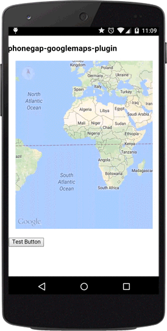

Change the camera position with animation.

### Description
The map view is modeled as a camera looking down on a flat plane. The position of the camera (and hence the rendering of the map) is specified by [CameraPosition](../../CameraPosition/README.md)

When you change the camera, you have the option of animating the resulting camera movement. The animation interpolates between the current camera attributes and the new camera attributes.
Default animation time of animateCamera() method is 5 seconds.

---

### Code
```js
var GOOGLE = {"lat": 37.422858, "lng": -122.085065};
map.animateCamera({
  'target': GOOGLE,
  'tilt': 60,
  'zoom': 18,
  'bearing': 140,
  'duration': 5000 // = 5 sec.
}, function() {
  console.log("The animation is done");
});
```



-----

### Fit camera to multiple points
This plugin accepts multiple [LatLng](../../LatLng/README.md) points to the `target` property.
You can pass either Array.[LatLng](../../LatLng/README.md) or [LatLngBounds](../../LatLngBounds/README.md).

If set, the plugin ignores `tilt`, `zoom` and `bearing` properties.
(Because Google Maps does not accept that values)

```js
var bounds = [
  {"lat": ..., "lng": ...}),
  {"lat": ..., "lng": ...}),
  {"lat": ..., "lng": ...}),
  {"lat": ..., "lng": ...})
];
map.animateCamera({
  'target': bounds,
  'tilt': 40,   // ignored
  'zoom': 18,   // ignored
  'bearing': 0  // ignored
}, function() {

});
```
