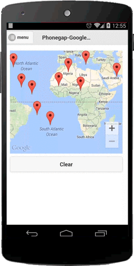

Remove all mark-ups, such as marker.

### Description
Removes all markers, polylines, polygons, overlays, etc from the map.

**Important!** This method does not remove event listeners.
You need to call `map.off()` separately if you want to reset.

---
### Code
```js
map.getVisibleRegion(function(latLngBounds) {
  var sw = latLngBounds.southwest;
  var ne = latLngBounds.northeast;
  var diffY = (ne.lat - sw.lat);
  var diffX = (ne.lng - sw.lng);

  for (var i = 0; i < 10; i++) {
    var latLng = new plugin.google.maps.LatLng(sw.lat + diffY * Math.random() , sw.lng  + diffX * Math.random());

    map.addMarker({
      'position': latLng
    }, function(marker) {
      map.on("test", function() {
        alert("test");
      });
    });
  }
});

$("#clearBtn").click(function() {
  map.clear();
  map.off();
  map.trigger("test");
});
```


