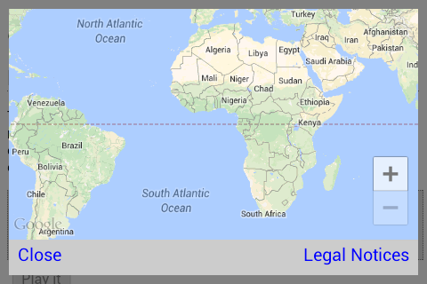

The `Map.getMap()` is a static method. You can grab a map instance.

### Description
The `Map.getMap()` method returns an instance of the map class.
The plugin initializes the native SDK and other things, which takes a few seconds.
The `MAP_READY` event is fired when the map is ready to go.

This plugin generates **only one map instance** using the `Map.getMap()` method.
In general, you may want to create multiple maps, but this plugin doesn't allow it.

### Parameters
```js
Map.getMap(div, params);
```
The first parameter is checked to see if it's a dom element. If it is not a dom element it will be treated as map initialization options and the second value will be ignored. If it is a dom element it will be used and the params parameter will be set as map initialization options.

### Code
```js
var map = plugin.google.maps.Map.getMap();
map.addEventListener(plugin.google.maps.event.MAP_READY, function onMapInit(map) {
  // The map is initialized, then show a map dialog
  map.showDialog();
});
```


----

### Create a map with initialize options
You can intialize the map status with options.
This is useful when you want to show the specific location of the map.
```js
const GORYOKAKU_JAPAN = {"lat": 41.796875, "lng": 140.757007};

var map = plugin.google.maps.Map.getMap({
  'backgroundColor': 'white',
  'mapType': plugin.google.maps.MapTypeId.HYBRID,
  'controls': {
    'compass': true,
    'myLocationButton': true,
    'indoorPicker': true,
    'zoom': true
  },
  'gestures': {
    'scroll': true,
    'tilt': true,
    'rotate': true,
    'zoom': true
  },
  'camera': {
    'latLng': GORYOKAKU_JAPAN,
    'tilt': 30,
    'zoom': 15,
    'bearing': 50
  }
});
```

