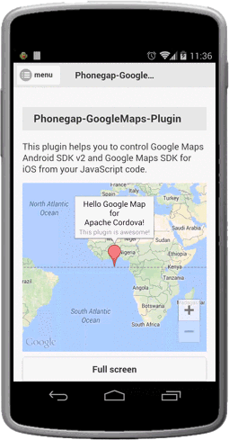

Force recalculate the map view location when the map is embedded.
Also updates the touchable regions internally.

So when you update the children size inside the map div, you should call this method.


### Code (with jQuery Mobile)
```js
  /**
   * jQuery Mobile's panel feature uses CSS transition,
   * However this plugin can not detect when CSS transition is started.
   *
   * For better performance, hide the map before transition,
   * then show it again after the transition is finished.
   */
  function hideMap() {
    map.setVisible(false);
  }

  function showMap() {
    // Map.refreshLayout() changes the map position forcely.
    // It causes slow or hang up on iOS,
    // so do not use too much.
    map.refreshLayout();

    map.setVisible(true);
  }

  $("#menulist").panel({
    "beforeclose": hideMap,
    "close": showMap,
    "beforeopen": hideMap,
    "open": showMap
  });
```

