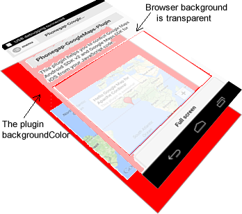

The `map.setBackgroundColor()` changes the background color of your app.

### Description
Since the map view places under the HTML, the background color of HTML (browser view) must be transparent.
In order to change the background color of your app, use this method.
You can specify the color with HTML colors, such as #FFFF00, "red", rgba(255, 0, 0, 0.5), hsv(100, 100, 10)



### Example
```js
document.addEventListener('deviceready', function() {
  var map = plugin.google.maps.Map.getMap($("#map_canvas")[0], {
    'backgroundColor': 'red'
  });

  var select = document.getElementById("color");
  select.addEventListener("change", function() {
    map.setBackgroundColor(this.value);
  });
});
```

```html
<select id="color">
  <option value="red">Red</option>
  <option value="#00FF00">#00FF00</option>
  <option value="rgba(0, 0, 255, 0.5)">rgba(0, 0, 255, 0.5)</option>
</select>
<div id="map_canvas" style="width:50%;height:50%;margin:10%"></div>
```


