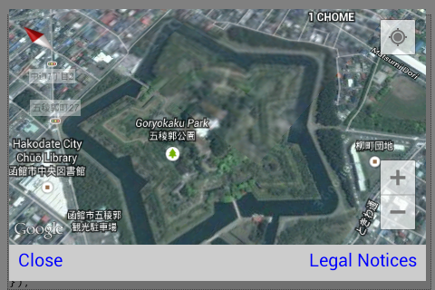
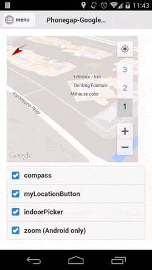
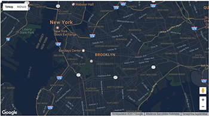

Creates a map with initialize options.
You can initialize the camera view when the map is initialized.
This is useful when you want to show the specific location of the map.

Also you can change the camera view and the UIs.
This is useful when you want to show the specific location of the map.
Available options are `mapType`, `controls`, `gestures`, `camera`, and `backgroundColor`.


```js
const GORYOKAKU_JAPAN = {"lat": 41.796875, "lng": 140.757007};

map.setOptions({
  'backgroundColor': 'white',
  'mapType': plugin.google.maps.MapTypeId.HYBRID,
  'controls': {
    'compass': true,
    'myLocationButton': true,
    'indoorPicker': true,
    'zoom': true // Only for Android
  },
  'gestures': {
    'scroll': true,
    'tilt': true,
    'rotate': true,
    'zoom': true
  },
  'camera': {
    'latLng': GORYOKAKU_JAPAN,
    'tilt': 30,
    'zoom': 15,
    'bearing': 50
  }
});
```


---

### Code

```js
const GOOGLE = {"lat": 37.422848, "lng": -122.085565};
map.moveCamera({
  'target': GOOGLE,
  'tilt': 60,
  'zoom': 18,
  'bearing': 140
});
$(":checkbox").off(); //jquery
$(":checkbox").on("change", function() {
  var optName = $(this).attr("id").replace("chk_", "");
  var options = {
    controls: {}
  };
  options.controls[optName] = $(this).is(":checked");
  map.setOptions(options);
});
```


---

### Custom styling google maps

You can add your own custom colors to the features and elements on google map.
- Keywords: `featureType, elementType, stylers`
```js
map.setOptions({
  styles: [
    {
      featureType: 'administrative.locality',
      elementType: 'labels.text.fill',
      stylers: [{ color: '#d59563' }]
    }
  ]
});
```


[More about styles](https://developers.google.com/maps/documentation/javascript/styling)