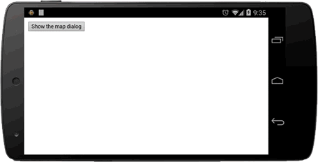

Display the map as full screen.

### Description
The map is displayed as full screen with the footer.
The footer has the "close" button and the "Legal Notifications" button.
The `MAP_CLOSE` event raises when the map dialog is closed.

The `Map.setVisible()` method is ignored when the map is full screen.

If you call the `Map.showDialog()` from the embedded map, the map goes back to the same position when the dialog is closed.

-----

### code
```js
document.addEventListener('deviceready', function() {
  // reate a map instance
  var map = plugin.google.maps.Map.getMap();

  // Waiting for the MAP_READY event
  map.addEventListener(plugin.google.maps.event.MAP_READY, onMapInit);
}, false);

function onMapInit(map) {

  // Show the map dialog when the button is clicked.
  var button = document.getElementById("button");
  button.addEventListener("click", function() {

    map.showDialog();

  }, false);

  // The MAP_CLOSE event will be fired when the map dialog is closed.
  map.addEventListener(plugin.google.maps.event.MAP_CLOSE, function() {

    alert("The map dialog is closed");

  });
}
```

