### Add a Marker
The **map.addMarker()** method takes a single Marker options object literal, specifying the initial properties of the marker.

The following fields are particularly important and commonly set when constructing a marker:

Field Name | Type | Description
----|------|----
icon |  Object | The icon [image url](#simple-icon) or [properties](#scaled-icon). Also you can specify [HTML Color values](#color-icon). Alternatively you can specify the image as [Base64](### Base64 Encoded Icon)
title | String | The content of the infoWindow.
snippet | String | The snippet of the infoWindow.
position | [LatLng](../LatLng/README.md) | The position of the marker.
infoWindowAnchor |[x, y] | Specify the anchor of the InfoWindow
draggable | Boolean | Set true if you want to enable to drag the marker. (Default: false) _**Important! Drag starts after long pressed on the marker.**_
flat | Boolean | Set true if you want to use a flat marker. (Default: false)
rotation | Number | Set rotation angle.  (Default: 0)
visible | Boolean | Set false if you want to hide.  (Default: true)
styles | Object | Specify the options for title. See the [description](#text-styling).
animation | String | Which animation to play when marker is added to a map.
zIndex | int | **iOS only, Plugin Version >= 1.3.3** Higher zIndex value overlays will be drawn on top of lower zIndex value tile layers and overlays. (You're able to run this on Android, but it will have no effect)

```js
document.addEventListener("deviceready", function() {
  var mapDiv = document.getElementById("map_canvas");

  const GOOGLE = {"lat": 37.422476, "lng": -122.08425};
  var map = plugin.google.maps.Map.getMap(mapDiv, {
    'camera': {
      'latLng': GOOGLE,
      'zoom': 17
    }
  });

  map.addEventListener(plugin.google.maps.event.MAP_READY, function() {

    map.addMarker({
      'position': GOOGLE,
      'title': "Hello GoogleMap for Cordova!"
    }, function(marker) {

      marker.showInfoWindow();

    });

  });
});
```


### Show/hide InfoWindow
Typically, an infoWindow is shown when you click a marker.
To show the infoWindow of the marker programmatically, call the marker.showInfoWindow() method. You can also hide the infoWindow with the marker.hideInfoWindow() method.

```js
marker.showInfoWindow();
marker.hideInfoWindow();
```

### Add a marker with multiple line
The cordova-googlemaps-plugin accepts the strings which include multiple line.
```js
map.addMarker({
  'position': {"lat": 0, "lng": 0},
  'title': ["Hello Google Map for", "Cordova!"].join("\n"),
  'snippet': "This plugin is awesome!"
}, function(marker) {
  marker.showInfoWindow();
});
```
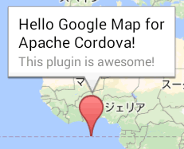

### Add your data, and hold them
You can set your data with other options, such as marker name.
Because Marker class inherit [BaseClass](../BaseClass/README.md).
BaseClass has `set()` and `get()` methods, thus, Marker also has `set()` and `get()`
```js
const GOOGLE = {"lat": 37.422858, "lng": -122.085065};
map.addMarker({
  'position': GOOGLE,
  'myMsg': 'Hello'
}, function(marker) {
  alert(marker.get("myMsg"));
});
```

### callback
The **map.addMarker()** method takes a callback function as the second argument.
The callback function is involved when the marker is created on the map.
You can get the instance of the marker from the argument of the callback function.
```js
map.addMarker({
  'position': STATUE_OF_LIBERTY,
  'title': "Statue of Liberty"
}, function(marker) {
  marker.showInfoWindow();
});
```
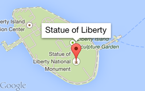

### Create multiple markers

Do you understand **why the below code crashes?**

```js
//
//  This is BAD example.
//  Don't use this code in your app!!
//
var data = [
  {'title': 'marker1', 'position': {lat: xxx, lng: xxx}},
  {'title': 'marker2', 'position': {lat: xxx, lng: xxx}},
   ...
  {'title': 'markerN', 'position': {lat: xxx, lng: xxx}}
];

var markers = [];
for (var i = 0; i < data.length; i++) {
  map.addMarker(data[i], function(marker) {
    markers.push(marker);
  });
}

markers[data.length - 1].showInfoWindow(); // <-- Error
```

Because this plugin has two sides: `JavaScript` side and `Native` side.
When you executes `map.addMarker()`, the plugin executes the native code asynchronize.

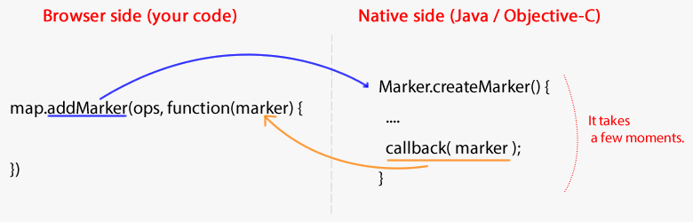

It means the JavaScript engine goes ahead before receiving the result.
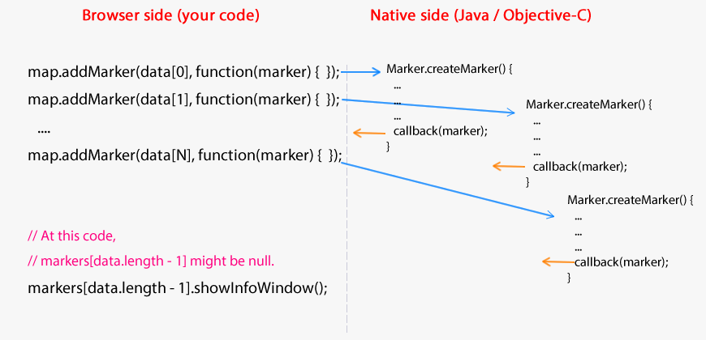

The correct way is that wait all results.

```js
addMarkers(data, function(markers) {
  markers[markers.length - 1].showInfoWindow();
});

function addMarkers(data, callback) {
  var markers = [];
  function onMarkerAdded(marker) {
    markers.push(marker);
    if (markers.length === data.length) {
      callback(markers);
    }
  }
  data.forEach(function(markerOptions) {
    map.addMarker(markerOptions, onMarkerAdded);
  });
}
```

### Simple Icon
In the most basic case, an icon can simply indicate an image to use instead of the default Google Maps pushpin icon. To specify such an icon, set the marker's icon property to the URL of an image. The Google Maps API will size the icon automatically.
You can use one of the following protocol: `https`, `file`, `cdvfile` and the file absolute path. (Android also accepts `file:///android_asset/`)
```js
map.addMarker({
  'position': GOOGLE_TOKYO,
  'title': 'Google Tokyo!',
  'icon': {
    'url': 'images/google_tokyo_icon.png'
   }
});
```


### Scaled Icon
You may want to specify scale of the icon to emphasize the marker.
You can specify the scale size to the marker's icon property using object literals.
The icon object literal supports only "url" and "size" properties currently.

**Although this plugin provides the size option, I recommend you should resize your icon image before loading.
It is effect to reduce the memory usage, and improve your application performance.**

```js
var iconSize = {
  width: 92,
  height: 148
};
map.addMarker({
  'position': latLng,
  'icon': {
     url: 'images/icon-yellow.png'
  }
}, function(marker) {
  $("#iconPercent").off();
  $("#iconPercent").change(function() {
    var scale = $(this).val();
    marker.setIcon({
      'url': 'images/icon-yellow.png',
      'size': {
        width: Math.round(iconSize.width * scale),
        height: Math.round(iconSize.height * scale)
      }
    });
  });

});
```
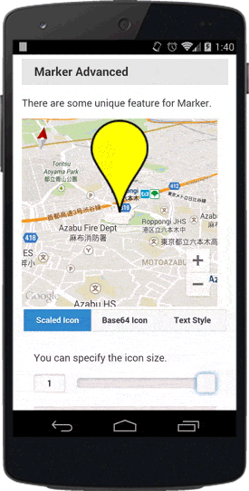

### Color Icon
You can specify [HTML color](./Available-HTML-colors) as icon.
The alpha value is ignored.

**black and white is not available for Android, because the native api accepts color as hue. This is not a bug, specification. Please read [How to set the marker color to black in google maps android(Stack Overflow)](http://stackoverflow.com/questions/28501998/how-to-set-the-marker-color-to-black-in-google-maps-android/28503769#28503769
)**
```js
map.addMarker({
  position: {"lat": 0, "lng": 0},
  icon: 'blue',
  'title': "Hello World!\nThis plugin is very awesome!",
  'snippet': "Tap here!"
}, function( marker ) {
  marker.showInfoWindow();
});
```


### Max-width for InfoWindow
You can specify maxWidth for InfoWindow (submit styles object to marker)
This can be percentage (%) or just a numeric value from 0.0 to 1.0 for percentile representation, or the numeric width in pixels.

```js
map.addMarker (
    {
        "position": position,

        "title": "This is the title.",
        "snippet": "And the description of this marker.",

        "styles": {
            "maxWidth": "80%" // This can be percentage (%) or just a numeric value from 0.0 to 1.0 for percentile representation, or the numeric width in pixels.
        }
    },
```

### Marker Animation
You can specify animation for marker.

Available values:
- plugin.google.maps.Animation.DROP (*Although the DROP animation bounces in iOS, Android does not bounce.*)
- plugin.google.maps.Animation.BOUNCE

```js
map.addMarker({
  position: {"lat": 35, "lng": 137},
  icon: "http://www.google.com/intl/en_us/mapfiles/ms/icons/blue-dot.png",
  animation: plugin.google.maps.Animation.DROP
}, function(marker) {

  var button = document.getElementById("button");
  button.addEventListener("click", function() {
    marker.setAnimation(plugin.google.maps.Animation.BOUNCE);
  });
});
```


### Text Styling
The infoWindow displays the text with left-align by default both on Android and iOS.
However, you can change the style using some options:

* text-align = left, center, right
* font-style = normal , italic
* font-weight = normal , bold
* color = red, #ccffcc, rgb(90, 32 100), etc

The text-align property effects to the snippet as well as the title.
```js
map.addMarker({
  'position': latLng,
  'title': "You can change the text-align specifying by the 'text-align' property.\n" +
           "This text is where you will see the result of the selected text-align property.",

  'snippet': 'The text-align property also effects to the snippet.',
  'styles' : {
    'text-align': 'center',
    'font-style': 'italic',
    'font-weight': 'bold',
    'color': 'red'
  }
}, function(marker) {
  marker.showInfoWindow();
});
```
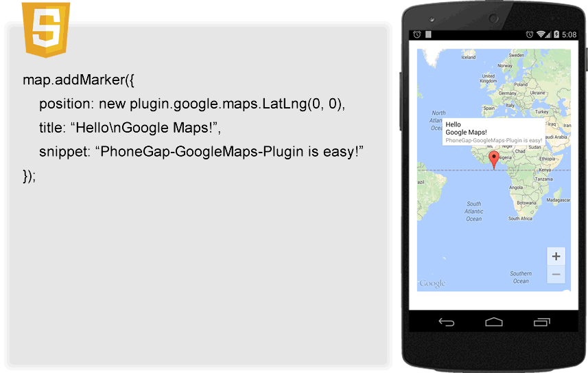


### Base64 Encoded Icon
The marker's icon and title properties accept base64 encoded image strings.
You can generate the base64 encoded strings using HTML5's Canvas object.
This means you are able to create marker image programmatically.
```js
var icon = "data:image/png;base64,iVBORw0KGgo...CC";
var canvas = document.createElement('canvas');
canvas.width = 120;
canvas.height = 40;
var context = canvas.getContext('2d');

var img = new Image();
img.src = "./images/google_logo.gif";
img.onload = function() {
  context.drawImage(img, 0, 0);

  context.font = '15pt Calibri';
  context.fillStyle = 'blue';
  context.fillText('Google', 40, 15);
  context.fillText('Tokyo!', 60, 35);

  map.addMarker({
    'position': latLng,
    'title': canvas.toDataURL(),
    'icon': icon
  }, function(marker) {
    marker.showInfoWindow();
  });
};
map.addMarker({
  'position': latLng,
  'title': canvas.toDataURL(),
  'icon': icon
}, function(marker) {
  marker.showInfoWindow();
});
```


### Remove the marker
To remove a marker from the map, call the remove() method.

```js
marker.remove();
```

### Events
Available events for Marker class are the below:
 * MARKER_CLICK
 * INFO_CLICK
 * MARKER_DRAG
 * MARKER_DRAG_START
 * MARKER_DRAG_END

### Click a marker
When you click a marker, a MARKER_CLICK event will be propagated to the marker.
```js
const GOOGLE_SYDNEY = {"lat": -33.867487, "lng": 151.20699};
map.addMarker({
  'position': GOOGLE_SYDNEY
}, function(marker) {

  marker.addEventListener(plugin.google.maps.event.MARKER_CLICK, function() {
    alert("Marker is clicked");
  });
});
```
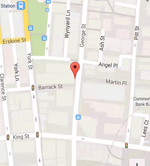

Alternatively you can also specify the click event handler to the map.addMarker()'s markerClick option.
This is useful when you want to run just small code.
```js
map.addMarker({
  'position': GOOGLE_SYDNEY,
  'markerClick': function(marker) {
    marker.showInfoWindow();
  }
});
```


### Click an infoWindow
When you click a marker, an INFO_CLICK event will be propagated to the marker.
```js
const GOOGLE_SYDNEY = {"lat": -33.867487, "lng": 151.20699};
map.addMarker({
  'position': GOOGLE_SYDNEY
}, function(marker) {
  marker.showInfoWindow();

  marker.addEventListener(plugin.google.maps.event.INFO_CLICK, function() {
    alert("InfoWindow is clicked");
  });
});
```

Alternatively you can also specify the click event handler to the map.addMarker()'s infoClick option.
This is useful when you want to run just small code.
```js
map.addMarker({
  'position': GOOGLE_SYDNEY,
  'title': "Google Sydney",
  'snippet': "click, then remove",
  'markerClick': function(marker) {
    marker.showInfoWindow();
  },
  'infoClick': function(marker) {
    marker.remove();
  }
});
```
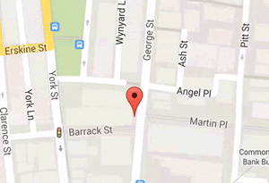

### Create a marker draggable
To allow users to drag a marker to a different location on the map, set draggable to true in the marker options.
_**Important! Drag starts after long pressed on the marker.**_
```js
const GOOGLE = {"lat": 37.422858, "lng": -122.085065};
map.addMarker({
  'position': GOOGLE,
  'draggable': true
});
```

Or you can enable with marker.setDraggable(true/false);
```js
map.addMarker({
  'position': GOOGLE
}, function(marker) {
  marker.setDraggable(true);
});
```
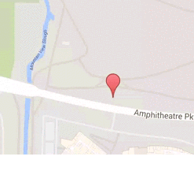

### Drag Events
The cordova-googlemaps-plugin fires MARKER_DRAG_START, MARKER_DRAG and MARGER_DRAG_END events when the marker starts drag, during dragging, and ends drag.

```js
map.addMarker({
  'position': GOOGLE,
  'draggable': true
}, function(marker) {

  marker.addEventListener(plugin.google.maps.event.MARKER_DRAG_END, function(marker) {
    marker.getPosition(function(latLng) {
      marker.setTitle(latLng.toUrlValue());
      marker.showInfoWindow();
    });
  });
});
```


### Create a flat marker
The flat option of map.addMarker() indicates whether this marker should be flat against the map true or a billboard facing the camera false. If the marker is flat against the map, it will remain stuck to the map as the camera rotates and tilts but will still remain the same size as the camera zooms, unlike a GroundOverlay. If the marker is a billboard, it will always be drawn facing the camera and will rotate and tilt with the camera. The default value is false.
```js
const GOOGLE = {"lat": 37.422858, "lng": -122.085065};
map.addMarker({
  'position': GOOGLE,
  'flat': true
});
```
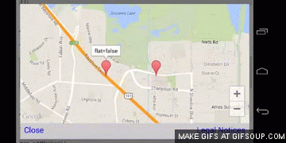

### Disable auto pan
You can disable auto panning when the marker is clicked.
```js
marker.addMarker({
  disableAutoPan: true
});
```
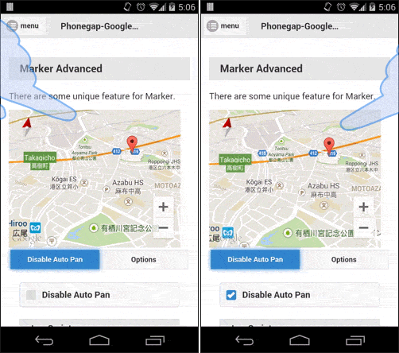

***
# Marker Class Reference
Method | Return value | Description
----|------|----
getPosition(callback) | void  | Involve the callback function with the marker location.
isVisible() | Boolean  | Return true if the marker is visible
setVisible(Boolean) | void  | Set false if you want to hide the marker.
getHashCode() | String  | Return the marker hash code.
remove() | void  | Remove the marker completely.
setOpacity(alpha) | void  | Change the marker opacity.
getOpacity() | Number  | Return the marker opacity.
setZIndex() | int  |  Higher zIndex value overlays will be drawn on top of lower zIndex value tile layers and overlays.
setIconAnchor(x, y) | void  | Change the info window anchor. This defaults to 50% from the left of the image and at the bottom of the image.
setInfoWindowAnchor(x, y) | void  | Change the info window anchor. This defaults to 50% from the left of the image and at the top of the image.
setDraggable(Boolean) | void  | Set true if you allows all users to drag the marker.
isDraggable() | Boolean  | Return true if the marker drag is enabled.
setFlat(Boolean) | void  | Set true if you want to be flat marker.
setIcon(Object) | void  | Change icon url and/or size (See the [example](#scaled-icon)).
setTitle(String) | void  | Change title of the infoWindow.
getTitle() | String  | Return the title strings.
setSnippet(String) | void  | Change snippet of the infoWindow.
getSnippet() | String  | Return the snippet strings.
setRotation(Number) | void  | Set the marker rotation angle.
getRotation() | Number  | Return the marker rotation angle.
showInfoWindow() | Number  | Show the infoWindow of the marker.
hideInfoWindow() | Number  | Hide the infoWindow of the marker.
setPosition([LatLng](../LatLng/README.md)) | void  | Set the marker position.
getPosition(callback) | Number  | Return the marker position.
getMap() | [Map](./Map)  | Return the map instance.
setAnimation(String) | void | Specify the animation either `plugin.google.maps.Animation.DROP` or `plugin.google.maps.Animation.BOUNCE`.
