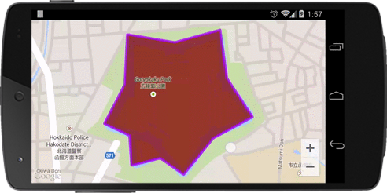
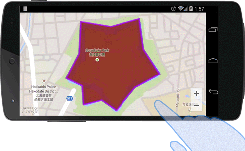

### Add a polygon
The **map.addPolygon()** method takes a single polygon options object literal, specifying the initial properties of the polygon.

The following fields are available when constructing a polygon:

Field Name | Type | Description
----|------|----
points | Array.[LatLng](../LatLng/README.md) | The array of LatLng position.
geodesic | Boolean | Indicates whether the segments of the polygon should be drawn as geodesics, as opposed to straight lines on the Mercator projection.
strokeColor | String | Specify the border color of the polygon. You can specify the [HTML colors](../../Available-HTML-colors/README.md)
strokeWidth | Number | The width of border.
fillColor | String | Specify the inside color of the polygon. You can specify the [HTML colors](../../Available-HTML-colors/README.md)
visible | Boolean | Set false if you want to hide. (Default: true)
zIndex | Number | Specify the zIndex. (Default: 2)
addHole | Array.[LatLng](../LatLng/README.md) | The array of LatLng position (currently only Android, iOS is not available)

```js
document.addEventListener("deviceready", function() {
  var mapDiv = document.getElementById("map_canvas");
  var map = plugin.google.maps.Map.getMap(mapDiv);

  map.addEventListener(plugin.google.maps.event.MAP_READY, function() {

    const GORYOKAKU_POINTS = [
      {"lat": 41.79883, "lng": 140.75675},
      {"lat": 41.799240000000005, "lng": 140.75875000000002},
      {"lat": 41.797650000000004, "lng": 140.75905},
      {"lat": 41.79637, "lng": 140.76018000000002},
      {"lat": 41.79567, "lng": 140.75845},
      {"lat": 41.794470000000004, "lng": 140.75714000000002},
      {"lat": 41.795010000000005, "lng": 140.75611},
      {"lat": 41.79477000000001, "lng": 140.75484},
      {"lat": 41.79576, "lng": 140.75475},
      {"lat": 41.796150000000004, "lng": 140.75364000000002},
      {"lat": 41.79744, "lng": 140.75454000000002},
      {"lat": 41.79909000000001, "lng": 140.75465},
      {"lat": 41.79883, "lng": 140.75673}
    ];
    map.addPolygon({
      'points': GORYOKAKU_POINTS,
      'strokeColor' : '#AA00FF',
      'strokeWidth': 5,
      'fillColor' : '#880000'
    }, function(polygon) {
      map.animateCamera({
        'target': polygon.getPoints()
      });
    });

  });
});
```


### callback
The **map.addPolygon()** method takes a callback function as the second argument.
The callback function is involved when the polygon is created on the map.
You can get the instance of the polygon from the argument of the callback function.
```js
map.addPolygon({
  'points': GORYOKAKU_POINTS,
  'strokeColor' : '#AA00FF',
  'strokeWidth': 5,
  'fillColor' : '#880000'
}, function(polygon) {

  setTimeout(function() {
    polygon.remove();
  }, 3000);
});
```

### Remove the polygon
To remove a polygon from the map, call the remove() method.

```js
polygon.remove();
```

### Click Event
You can listen the click event using `OVERLAY_CLICK` event.

```js
map.addPolygon({
  'points': GORYOKAKU_POINTS,
  'strokeColor' : '#AA00FF',
  'strokeWidth': 5,
  'fillColor' : '#880000'
}, function(polygon) {

  polygon.on(plugin.google.maps.event.OVERLAY_CLICK, function(overlay, latLng) {
    polygon.setFillColor("blue");
    polygon.setStrokeColor("green");
    polygon.setStrokeWidth(10);
  });

});
```


***
# Polygon Class Reference
Method | Return value | Description
----|------|----
getPoints() | Array.[LatLng](../LatLng/README.md)  | Return the array of positions.
getStrokeColor() | String  | Return the stroke color..
getFillColor() | String  | Return the fill color.
getStrokeWidth() | Number  | Return the border width.
getGeodesic() | Boolean | Return true if the polygon is drawn as geodesic.
getVisible() | Boolean | Return true if the polygon is visible.
getZIndex() | Boolean | Return zIndex.
remove() | void | Remove the polygon.
setPoints(Array.[LatLng](../LatLng/README.md)) | void | Set the points.
setStrokeColor(String) | void | Set the border color.
setFillColor(String) | void | Set the fill color.
setStrokeWidth(Number) | void | Set the border width.
setVisible(Boolean) | void | Set false if you want to hide.
setZIndex(Number) | void | Set the zIndex.
setGeodesic(Boolean) | void | Set true if you want to draw the polygon as geodesic.
getMap() | [Map](../Map/README.md)  | Return the map instance.
