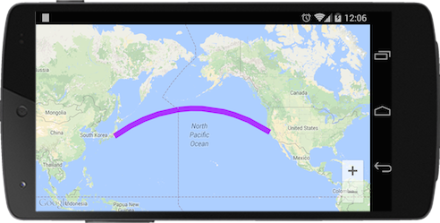

### Add a polyline
The **map.addPolyline()** method takes a single polyline options object literal, specifying the initial properties of the polyline.

The following fields are available when constructing a polyline:

Field Name | Type | Description
----|------|----
points | Array.[LatLng](../LatLng/README.md) | The array of LatLng position.
visible | Boolean | false if you want to hide.
geodesic | Boolean | Indicates whether the segments of the polyline should be drawn as geodesics, as opposed to straight lines on the Mercator projection.
color | String | Specify the border color of the polyline. You can specify the [HTML colors](../../Available-HTML-colors/README.md)
width | Number | The width of border.
visible | Boolean | Set false if you want to hide.
zIndex | Number | Specify the zIndex. (Default: 4)

```js

document.addEventListener("deviceready", function() {
  var mapDiv = document.getElementById("map_canvas");
  var map = plugin.google.maps.Map.getMap(mapDiv);

  map.addEventListener(plugin.google.maps.event.MAP_READY, function() {

      const HND_AIR_PORT = {"lat": 35.548852, "lng": 139.784086};
      const SFO_AIR_PORT = {"lat": 37.615223, "lng": -122.389979};
      map.addPolyline({
        points: [
          HND_AIR_PORT,
          SFO_AIR_PORT
        ],
        'color' : '#AA00FF',
        'width': 10,
        'geodesic': true
      });

  });
});

```


### callback
The **map.addPolyline()** method takes a callback function as the second argument.
The callback function is involved when the polyline is created on the map.
You can get the instance of the polyline from the argument of the callback function.
```js
map.addPolyline({
  points: [
    HND_AIR_PORT,
    SFO_AIR_PORT
  ],
  'color' : '#AA00FF',
  'width': 10,
  'geodesic': true
}, function(polyline) {

  setTimeout(function() {
    polyline.remove();
  }, 3000);
});
```

### Remove the polyline
To remove a polyline from the map, call the remove() method.

```js
polyline.remove();
```


### Click Event
You can listen the click event using `OVERLAY_CLICK` event.
```js
const HND_AIR_PORT = {"lat": 35.548852, "lng": 139.784086};
const SFO_AIR_PORT = {"lat": 37.615223, "lng": -122.389979};
const HNL_AIR_PORT = {"lat": 21.332898, "lng": -157.921418};

var idx = 0;
map.addPolyline({
  'points': [
    HND_AIR_PORT,
    HNL_AIR_PORT,
    SFO_AIR_PORT
  ],
  'color' : "red",
  'width': 10,
  'geodesic': true
}, function(polyline) {
  polyline.on(plugin.google.maps.event.OVERLAY_CLICK, function() {
    polyline.setColor(["green", "blue", "orange", "red"][idx++]);
    idx = idx > 3 ? 0 : idx;
  });
});
```


***
# Polyline Class Reference
Method | Return value | Description
----|------|----
getPoints() | Array.[LatLng](../LatLng/README.md)  | Return the array of positions.
getColor() | String | Return the border color.
getWidth() | Number  | Return the border width.
getGeodesic() | Boolean | Return true if the polyline is drawn as geodesic.
getVisible() | Boolean | Return true if the polyline is visible.
getZIndex() | Boolean | Return zIndex.
remove() | void | Remove the polyline.
setPoints(Array.[LatLng](../LatLng/README.md)) | void | Set the points.
setColor(String) | void | Set the border color.
setWidth(Number) | void | Set the border width.
setVisible(Boolean) | void | Set false if you want to hide.
setZIndex(Number) | void | Set the zIndex.
setGeodesic(Boolean) | void | Set true if you want to draw the polyline as geodesic.
getMap() | [Map](../Map/README.md)  | Return the map instance.
