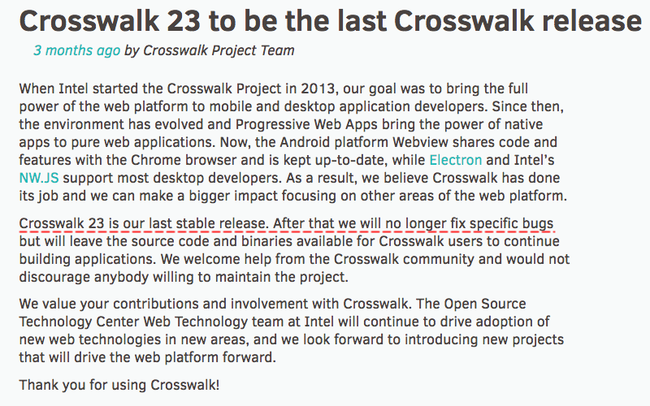

:warning: **This document is aim for older versions (from 2.0.0 to 2.2.9).
Document for new version is https://github.com/mapsplugin/cordova-plugin-googlemaps-doc/blob/master/v2.6.0/README.md**

# Use the cordova-googlemaps-plugin v2.0 with Crosswalk plugin

The cordova-plugin-crosswalk-webview is based on Chromium webview engine for Cordova.
It is faster than regular android webview.

[Unfortunately, the Crosswalk project has been already retired.](https://crosswalk-project.org/blog/crosswalk-final-release.html)



However, you can still use the cordova-plugin-crosswalk-webview plugin.


In order to use the cordova-plugin-crosswalk-webview with the cordova-googlemaps-plugin v2.0,
you need to install the plugin, then add the below two preferences in the config.xml.

## 1. Add Crosswalk webview plugin

```
cordova plugin add cordova-plugin-crosswalk-webview
```

## 2. Add the below two lines into the config.xml

```xml
<preference name="xwalkZOrderOnTop" value="true" />
<preference name="BackgroundColor" value="0" />
```

## 3. Built and Run

For Android, just type this command:

```bash
$> cordova run android
```

That's it!
