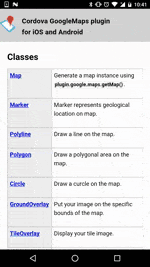

# Cordova GoogleMaps plugin for iOS and Android v2 (beta)

**This is beta version of the Cordova GoogleMaps plugin version 2. The code won't change significantly, but it might be modified without announcing in advance**

- [What's new in version 2?](whats-new-v2/README.md)

- [How to install the v2-beta?](Installation/README.md)

- [Migrate from v1 to v2](migrate-from-v1/README.md)

- [For ionic2 users](For-ionic2-users/README.md)
