# Release notes for @ionic-native version 4.3.3

- ## Update: Specifying element Id for map.create()

  When you create a map, your code might be like this:

  ```
  let div = document.getElementById('map_canvas');

  this.map = this.googleMaps.create(div);
  ```

  How about if you define `<div id="map_canvas"></div>` in pageA and pageB,
  which div element does `document.getElementById('map_canvas')` return, pageA or pageB?

  Actually pageA instead of pageB in some case.
  Since the Ionic framework uses fade-in/fade-out, even `ionViewLoaded()` is occurred, the pageA is still remained.
  That's why `document.getElementById('map_canvas')` returns the div element of pageA.

  If you specify the element Id of map div, the plugin waits until the pageB is ready.

  ```
  this.map = this.googleMaps.create('map_canvas');
  ```

  I recommend this way for ionic users.

- ## Add: the cssOptions argument for HtmlInfoWindow.setContent() method

  You can specify additional CSS styles for HtmlInfoWindow.

  ```TypeScript
  let htmlInfoWindow = new HtmlInfoWindow();

  htmlInfoWindow.setContent("<h3>HelloWorld</h3>", {
    width: "280px",
    height: "330px",
    color: "red"
  });

  htmlInfoWindow.open(marker);
  ```

- ## Add: forEachAsync(), mapAsync(), and filterAsync() methods into BaseArray class.

  - BaseArrayClass.forEach()
    <table>
    <tr>
      <td><a href="./forEach1.jpg">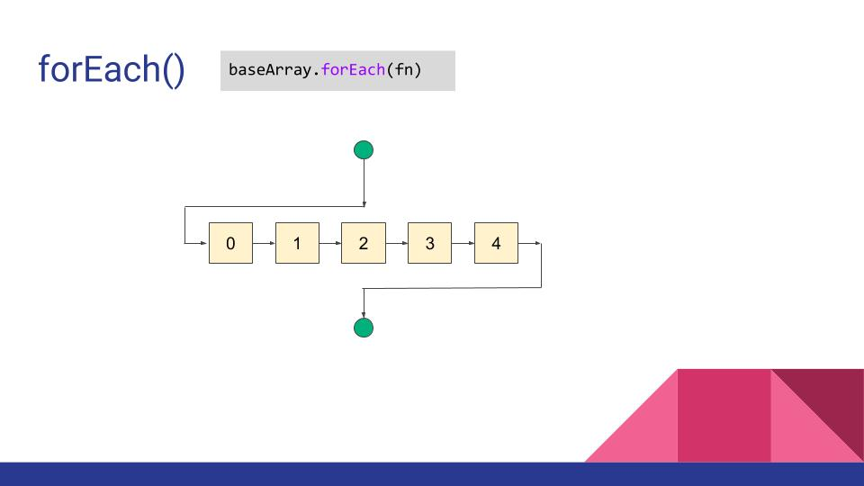<br>(click for large image)</a></td>
      <td><a href="./forEach2.jpg">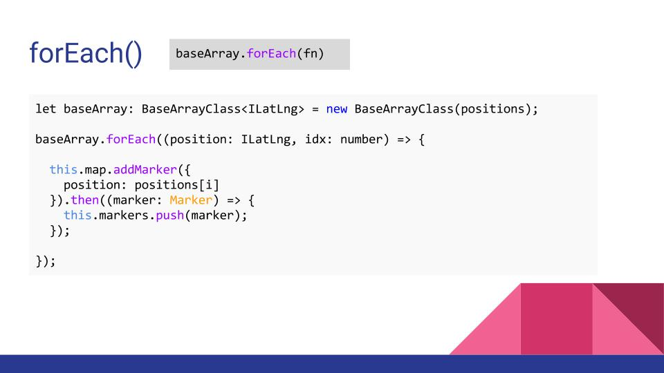<br>(click for large image)</a></td>
    </tr>
    </table>
  - BaseArrayClass.forEachAsync()
    <table>
    <tr>
      <td><a href="./forEachAsync1.jpg">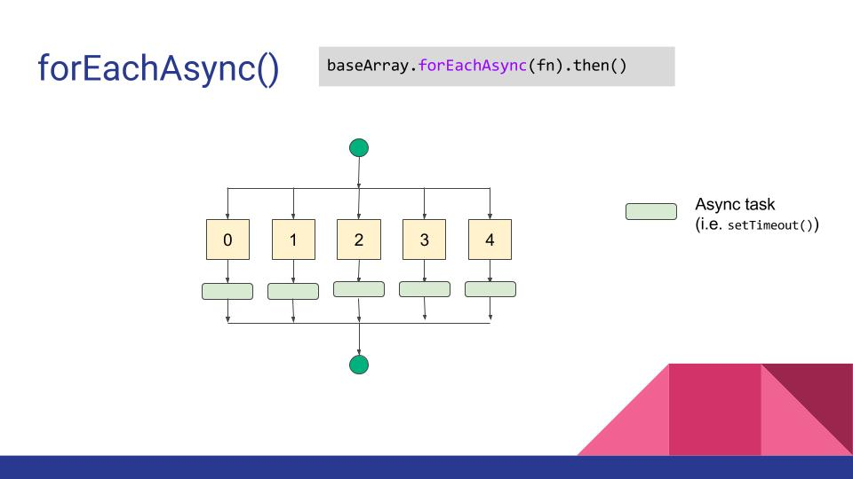<br>(click for large image)</a></td>
      <td><a href="./forEachAsync2.jpg"><br>(click for large image)</a></td>
    </tr>
    </table>
  - BaseArrayClass.map()
    <table>
    <tr>
      <td><a href="./forEachAsync1.jpg">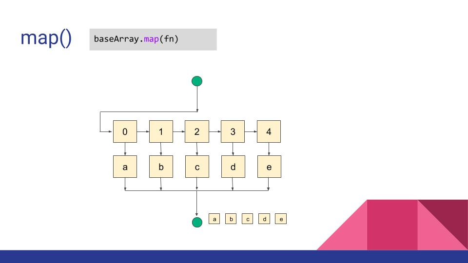<br>(click for large image)</a></td>
      <td><a href="./forEachAsync2.jpg">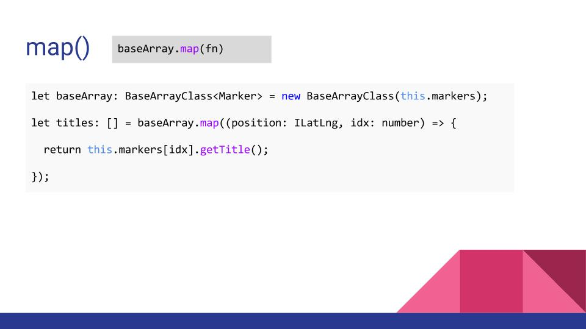<br>(click for large image)</a></td>
    </tr>
    </table>
  - BaseArrayClass.mapAsync()
    <table>
    <tr>
      <td><a href="./mapAsync1.jpg">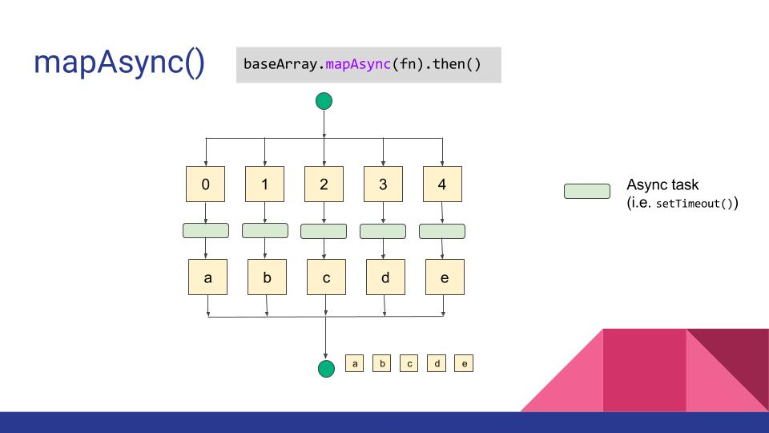<br>(click for large image)</a></td>
      <td><a href="./mapAsync2.jpg">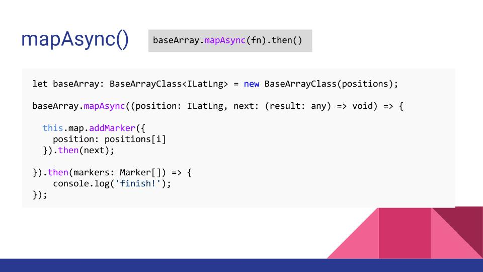<br>(click for large image)</a></td>
    </tr>
    </table>
  - BaseArrayClass.filter()
    <table>
    <tr>
      <td><a href="./filter1.jpg">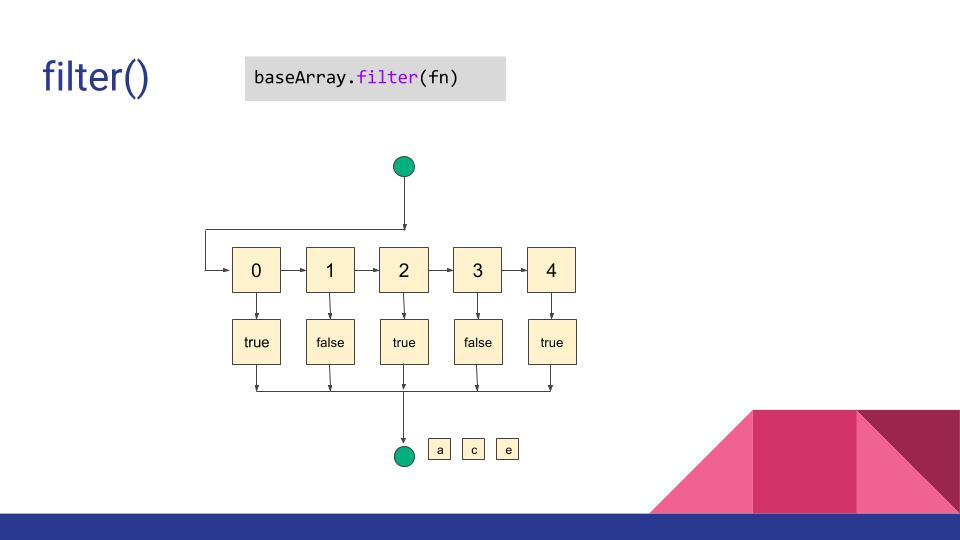<br>(click for large image)</a></td>
      <td><a href="./filter2.jpg">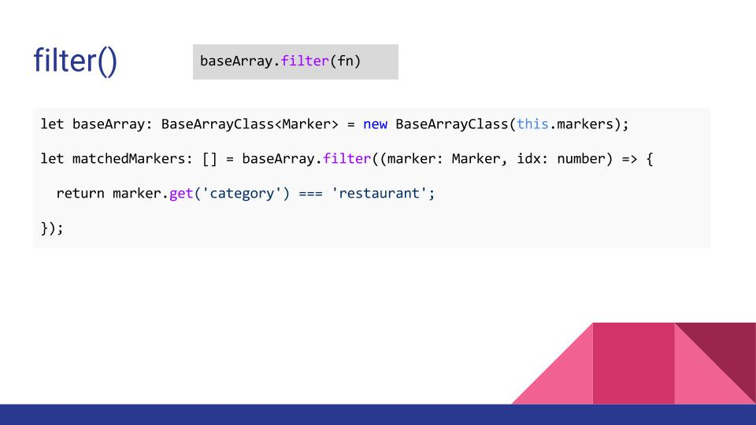<br>(click for large image)</a></td>
    </tr>
    </table>
  - BaseArrayClass.filterAsync()
    <table>
    <tr>
      <td><a href="./filterAsync1.jpg">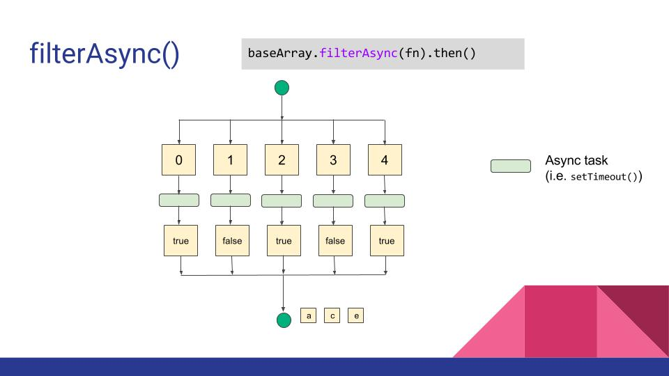<br>(click for large image)</a></td>
      <td><a href="./filterAsync2.jpg">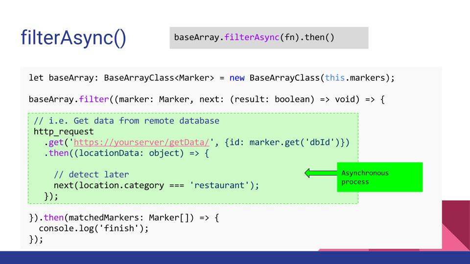<br>(click for large image)</a></td>
    </tr>
    </table>

- Bug fix: Polyline.getPoints(), Polygon.getPoints() and Polygon.getHoles() do not return the instance of BaseArray class.

- Bug fix: Error when removing map [#1823](https://github.com/mapsplugin/cordova-plugin-googlemaps/issues/1823)

- Bug fix: missing `clickable` option for PolygonOptions and PolylineOptions.
