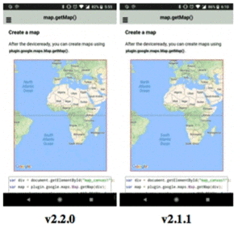
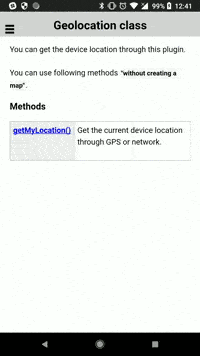
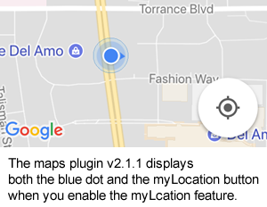
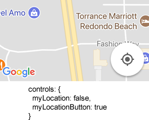
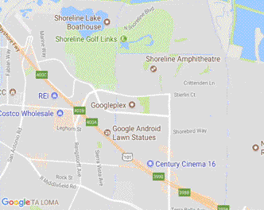
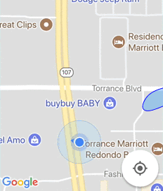
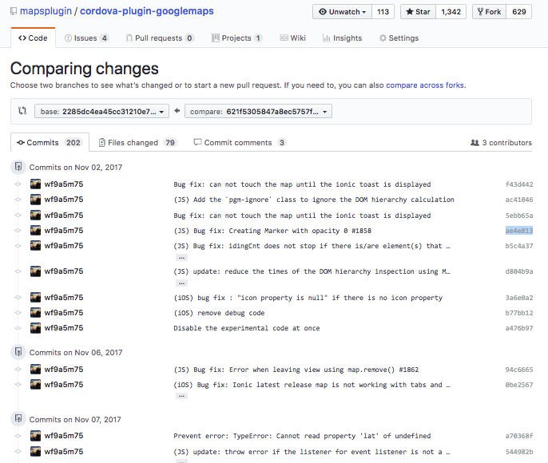

# Release notes version 2.2.0

---
Featured points
------------------------------------------------------------------------

### Welcome back the `KmlOverlay`!

I'm really happy to introduce new KmlOverlay!
The new KmlOverlay supports many tags than the maps plugin v1.4.0.

Supported tags are:
<table>
<tr>
  <td>kml</td><td>folder</td><td>placemark</td><td>document</td><td>multigeometry</td>
</tr>
<tr>
  <td>photooverlay</td><td>point</td><td>polygon</td><td>linestring</td><td>groundoverlay</td>
</tr>
<tr>
  <td>networklink<br>(&lt;region&gt; is also supported)</td><td>lookat</td><td>extendeddata</td><td>schema</td><td>styles</td>
</tr>
<tr>
  <td>balloonstyle<br>(&lt;description&gt; only)</td><td>iconstyle</td><td>styleurl</td><td>stylemap<br>(normal mode only)</td><td>coordinates</td>
</tr>
</table>

Regarding of `<ExtendedData>` tag, if the kml file contains `<BaloonStyle>` tag as template,
the maps plugin v2.2.0 displays just like defined. Otherwise, draw a table like below.


The usage is really easy.

```
map.addKmlOverlay({
  'url': (KML file path or URL),   // <-- .KMZ file is not supported yet!
  'clickable': true,
  'suppressInfoWindows': false
}, function(kmlOverlay) {

  // debug
  //console.log(kmlOverlay.getKmlData());

  // You can get additional information
  //kmlOverlay.on(plugin.google.maps.event.KML_CLICK, function(overlay, latLng) {
  //  console.log(overlay);
  //});

  // You need to change the camera by yourself.
  map.moveCamera(kmlOverlay.camera, function() {

    //close the dialog
    mapDiv.removeChild(dialogDiv);

  });

});
```

Other tags that are not listed the above table, you can still get the data.
New KML parser returns all tag elements.


---

### Just like a HTML element!

**You should not face the Maps not clickable problem anymore!**

The maps plugin v2.2.0 implements correct HTML hierarchy calculation algorithm.
It means if you open an HTML dialog over the map, you don't need to execute `map.setClickable(false)`.
The maps plugin detects it correctly.

This is big benefits for the users that use JS frameworks, such as `ionic` or `framework7`.
Because these frameworks support multiple page mechanism in variable ways.

Also the DOM inspection performance has been improved significantly.

### No longer support for Android 4.3 or lower versions

The maps plugin v2.2.0 implements a new way to detect the DOM hierarchy,
the plugin uses `MutableObserver`. Because of this, no longer support for Android 4.3 or lower versions.

### Improve the maps positioning

The maps plugin v2.2.0 becomes better the maps positioning than ever.



### (iOS) Fix the problem that can not click on DatePicker(or other) plugins.

In the past, you can **not** click on other plugins such as DatePicker.
Because these plugins insert their own native views under the browser view.
But this problem is fixed at this version.


---

### LocationService.getMyLocation() without map!

Some people use [cordova-plugin-geolocation](https://github.com/apache/cordova-plugin-geolocation), because they want to know the device location **before creating a map**.

From the maps plugin v2.2.0, you can get the location throw `LocationService` static class.

```js
// Get the device location without map first.
plugin.google.maps.LocationService.getMyLocation(function(result) {

  // Then create a map with the location.
  var map = plugin.google.maps.Map.getMap(mapDiv, {
    'mapType': plugin.google.maps.MapTypeId.HYBRID,
    'camera': {
      target: result.latLng,
      zoom: 16
    }
  });

  map.addEventListener(plugin.google.maps.event.MAP_READY, function() {
     ...
  });
});
```



---

### The `myLocation` property is changed!

This is really important announce. You set `controls.myLocation = true` when you want to display the current location (aka, `blue dot`);

Until the maps plugin v2.1.1, the plugin displays/hides both the `blue dot` and the `myLocation button` together.
Because the Google Maps Android API v2 implements so like that.



However I figured out the way to control them separately.
From the maps plugin v2.2.0, you can hide the `myLocationButton` but display the `blue dot`.


How about the opposite case? Yes, possible.



In this case, if you tap on the myLocation button, the map does not do anything because `myLocation = false`. But you can get the event with `MY_LOCATION_BUTTON_CLICK` event.

```js
map.on(plugin.google.maps.event.MY_LOCATION_BUTTON_CLICK, function() {
  alert("The my location button is clicked.");
});
```

---

### The `POI_CLICK` event

When you tap on POIs, you can get the information.

```js
map.on(plugin.google.maps.event.POI_CLICK, function(placeId, name, latLng) {
  map.addMarker({
    'position': latLng,
    'title': [
      "placeId = " + placeId,
      "name = " + name,
      "position = " + latLng.toUrlValue()
    ].join("\n")
  }, function(marker) {
    marker.showInfoWindow();
  });
});
```


---

### The `MY_LOCATION_CLICK` event

You can listen the `MY_LOCATION_CLICK` event.
This event is fired when you tap on the `blue dot`.

```js
map.on(plugin.google.maps.event.MY_LOCATION_CLICK, function(location) {
  map.addMarker({
    'title': ["Current your location:\n",
        "latitude:" + location.latLng.lat.toFixed(3),
        "longitude:" + location.latLng.lng.toFixed(3),
        "speed:" + location.speed,
        "time:" + location.time,
        "bearing:" + location.bearing].join("\n"),
    'position': location.latLng,
    'animation': plugin.google.maps.Animation.DROP,
    'disableAutoPan': true
  }, function(marker) {
    marker.showInfoWindow();
  });
});
```



---

### BaseArrayClass

Useful methods are added to `BaseArrayClass`.

  - [mapAsync(value, fn)](../../class/BaseArrayClass/mapAsync/README.md)
  - [mapSeries(value, fn)](../../class/BaseArrayClass/mapSeries/README.md)
  - [filterAsync(value, fn)](../../class/BaseArrayClass/filterAsync/README.md)

---

### Specify the SDK version of Google Play Services.


You can specify the SDK version of Google Play Services.

**Note that the maps plugin v2.2.0 requires the Google Play Services v11.8.0 or over.**

Example using the Cordova CLI

```bash
$> cordova plugin add cordova-plugin-googlemaps \
    --variable API_KEY_FOR_ANDROID="..." \
    --variable API_KEY_FOR_IOS="..." \
    --variable PLAY_SERVICES_VERSION="11.8.0"
```

Example using config.xml
```xml
<plugin name="cordova-plugin-googlemaps" spec="2.2.0">
    <variable name="API_KEY_FOR_ANDROID" value="YOUR_ANDROID_API_KEY_IS_HERE" />
    <variable name="API_KEY_FOR_IOS" value="YOUR_IOS_API_KEY_IS_HERE" />
    <variable name="PLAY_SERVICES_VERSION" value="11.8.0" />
</plugin>
```

---

### `CLUSTER_CLICK` event is removed

Even if you want to use this event, you can still listen like this:

```
markerCluster.on('cluster_click', function() {
  ...
});
```

---

### `MAP_LOADED` event is removed

This event is removed completely.

---

Working logs
------------------------------------------------------------------------

https://github.com/mapsplugin/cordova-plugin-googlemaps/compare/2285dc4ea45cc31210e7997b7d4fd0083c9f08b4...621f5305847a8ec5757f8129c5f34b2fca81bfc2


