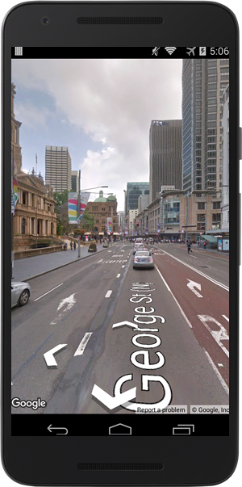
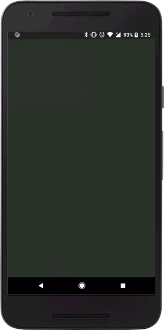
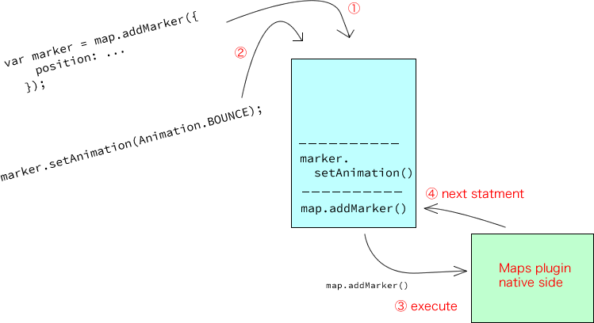

# Release notes version 2.3.0

---
Featured points
------------------------------------------------------------------------

### New feature: StreetView

I am proud to introduce you to a new plugin feature: `StreetView`!
You can create a street view panorama container as well as a map container.

```
var div = document.getElementById("pano_canvas1");
var panorama = plugin.google.maps.StreetView.getPanorama(div, {
  camera: {
    target: {lat: 42.345573, lng: -71.098326}
  }
});
```



---

### A `callback` is no longer required for the most part.

# _This is a big breaking change!_

The `cordova-plugin-googlemaps` plugin does not **require** the `callback` anymore with **most of the methods**.

Previously you had to wait for the `MAP_READY` event before you could add a marker like this:

```js
var map = plugin.google.maps.Map.getMap(mapDiv, {
    camera: {
      target: {lat: -33.87365, lng: 151.20689},
      zoom: 16
    }
  });
map.one(plugin.google.maps.event.MAP_READY, function() {

  map.addMarker({
    position: {lat: -33.87365, lng: 151.20689}
  }, function(marker) {
    marker.setAnimation(plugin.google.maps.Animation.BOUNCE);
  });

});
```

Now with version 2.3.0, you can simply write the code like this!

```js
var map = plugin.google.maps.Map.getMap(mapDiv, {
    camera: {
      target: {lat: -33.87365, lng: 151.20689},
      zoom: 16
    }
  });

var marker = map.addMarker({
  position: {lat: -33.87365, lng: 151.20689}
});

marker.setAnimation(plugin.google.maps.Animation.BOUNCE);
```

The coding is simpler now because you can chain methods!

```js
var map = plugin.google.maps.Map.getMap(mapDiv, {
    camera: {
      target: {lat: -33.87365, lng: 151.20689},
      zoom: 16
    }
  });

var marker = map.addMarker({
    position: {lat: -33.87365, lng: 151.20689}
  })
  .setAnimation(plugin.google.maps.Animation.BOUNCE);
```



#### What's the trick?

`Map`, `StreetView`, and `Overlay (Marker, Polygon, etc...)` reside in the command queue.
Until any instance is fully ready, these classes just stack your statements into the queue.
When an instance is ready, it is pulled from the queue and executed.



You can still write your code using the previous `callback` style.
The `callback` is invoked when the instance is fully ready.
_It is the safest way._

```js
map.addMarker({
    position: {lat: -33.87365, lng: 151.20689}
  }, function(marker) {
    // The marker is fully ready.
  });
```

But without the callback, you can write your code simply using ;)
```js
var marker = map.addMarker({
  position: {lat: -33.87365, lng: 151.20689}
});
```

#### Which methods are available with this new style?

- Map.getMap()
- StreetView.getPanorama()
- map.addMarker()
- map.addCircle()
- map.addPolygon()
- map.addPolyline()
- map.addGroundOverlay()
- map.addMarkerCluster()
- map.addTileOverlay()

---

Working logs
------------------------------------------------------------------------

https://github.com/mapsplugin/cordova-plugin-googlemaps/compare/2285dc4ea45cc31210e7997b7d4fd0083c9f08b4...621f5305847a8ec5757f8129c5f34b2fca81bfc2


