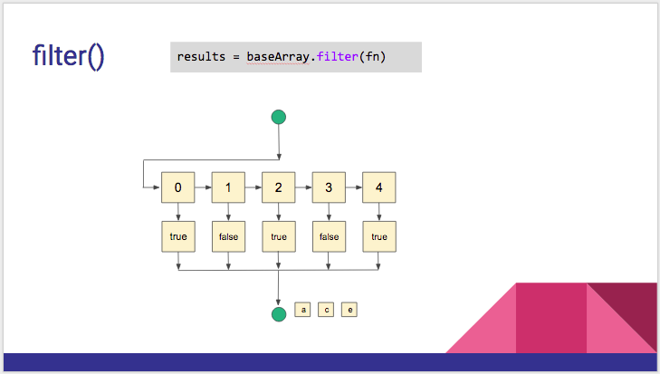

:warning: **This document is aim for older versions (from 2.0.0 to 2.2.9).
Document for new version is https://github.com/mapsplugin/cordova-plugin-googlemaps-doc/blob/master/v2.6.0/README.md**

# baseArrayClass.filter(fn)



```js

var baseArray = new plugin.google.maps.BaseArrayClass([
  1, 2, 3, 4, 5
]);

var results = baseArray.filter(function(value) {
  return value % 2 === 0;
});

console.log(results);

// [output]
//   results = [2, 4]
```
