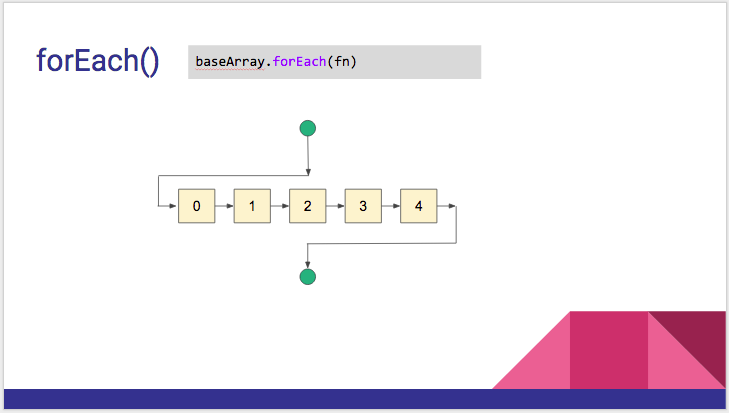

# baseArrayClass.forEach(fn)




```js

var baseArray = new plugin.google.maps.BaseArrayClass([
  1, 2, 3, 4, 5
]);

baseArray.forEach(function(element, idx) {
  console.log("baseArray[" + idx + "] = " + element);
});

console.log("done!");

// [output]
//   baseArray[0] = 1
//   baseArray[1] = 2
//   baseArray[2] = 3
//   baseArray[3] = 4
//   baseArray[4] = 5
//   done!
```
