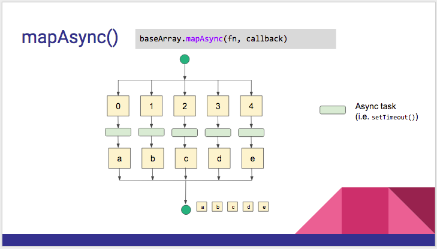

:warning: **This document is aim for older versions (from 2.0.0 to 2.2.9).
Document for new version is https://github.com/mapsplugin/cordova-plugin-googlemaps-doc/blob/master/v2.6.0/README.md**

# baseArrayClass.mapAsync(fn, callback)



```js

var baseArray = new plugin.google.maps.BaseArrayClass([
  {lat: 41.79883, lng: 140.75675},
  {lat: 41.799240000000005, lng: 140.75875000000002},
  {lat: 41.797650000000004, lng: 140.75905},
  {lat: 41.79637, lng: 140.76018000000002},
  {lat: 41.79567, lng: 140.75845},
  {lat: 41.794470000000004, lng: 140.75714000000002},
  {lat: 41.795010000000005, lng: 140.75611},
  {lat: 41.79477000000001, lng: 140.75484},
  {lat: 41.79576, lng: 140.75475},
  {lat: 41.796150000000004, lng: 140.75364000000002},
  {lat: 41.79744, lng: 140.75454000000002},
  {lat: 41.79909000000001, lng: 140.75465}
]);

baseArray.mapAsync(function(element, cb) {

  map.addMarker({
    "position": element
  }, cb);

}, function(markers) {

  // markers[0] ... markers[n]

});

```
