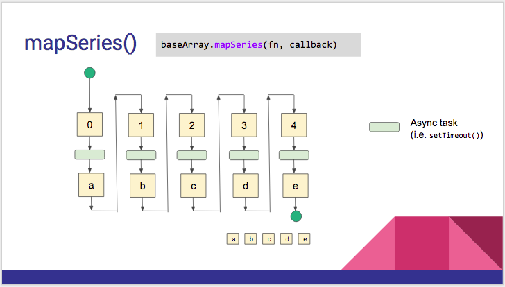

:warning: **This document is aim for older versions (from 2.0.0 to 2.2.9).
Document for new version is https://github.com/mapsplugin/cordova-plugin-googlemaps-doc/blob/master/v2.6.0/README.md**

# baseArrayClass.mapAsync(fn, callback)



```js

var baseArray = new plugin.google.maps.BaseArrayClass([
  {placeId: "ChIJN1t_tDeuEmsRUsoyG83frY4"},
  {placeId: "ChIJyWEHuEmuEmsRm9hTkapTCrk"},
  {placeId: "ChIJLfySpTOuEmsRsc_JfJtljdc"}
]);

var idx = 0;
baseArray.mapSeries(function(placeData, next) {

  // example: Obtain data from your server
  getInfomationFromDB(placeData, function(latLng) {

    map.addMarker({
      "position": latLng,
      "idx": (idx++)
    }, next);

  });

}, function(markers) {

  // markers[0] ... markers[n]

});

```
