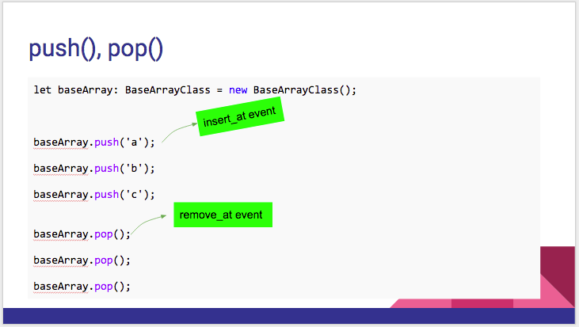

:warning: **This document is aim for older versions (from 2.0.0 to 2.2.9).
Document for new version is https://github.com/mapsplugin/cordova-plugin-googlemaps-doc/blob/master/v2.6.0/README.md**

# baseArrayClass.push()

Adds one element to the end of the array and returns the new length of the array.



```js
var baseArray = new plugin.google.maps.BaseArrayClass();

var i;
for(i = 0; i < 10; i++) {
  baseArray.push(i);
}

var value = baseArray.pop();
console.log(value);  //value = 9
```
