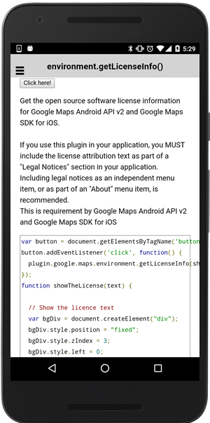

:warning: **This document is aim for older versions (from 2.0.0 to 2.2.9).
Document for new version is https://github.com/mapsplugin/cordova-plugin-googlemaps-doc/blob/master/v2.6.0/README.md**

# Environment.getLicenseInfo()

Get the open source software license information for ~~Google Maps Android API v2 and~~ Google Maps SDK for iOS.

If you use this plugin in your application, you **MUST** include the license attribution text as part of a **"Legal Notices"** section in your application.
Including legal notices as an independent menu item, or as part of an "About" menu item, is recommended.

This is requirement by ~~Google Maps Android API v2 and~~ Google Maps SDK for iOS.

```html
<button>Click here!</button>
```

```js
var button = document.getElementsByTagName('button')[0];
button.addEventListener('click', function() {
  plugin.google.maps.environment.getLicenseInfo(showTheLicense);
});
function showTheLicense(text) {

  // Show the licence text
  var bgDiv = document.createElement("div");
  bgDiv.style.position = "fixed";
  bgDiv.style.zIndex = 3;
  bgDiv.style.left = 0;
  bgDiv.style.top = 0;
  bgDiv.style.bottom = 0;
  bgDiv.style.right = 0;
  bgDiv.style.backgroundColor = "rgba(0,0,0,0.5)";

  var textDiv = document.createElement("div");
  textDiv.style.width = "85%";
  textDiv.style.height = "85%";
  textDiv.style.top = "5%";
  textDiv.style.left = "5%";
  textDiv.style.right = "5%";
  textDiv.style.bottom = "5%";
  textDiv.style.overflowY = "scroll";
  textDiv.style.WebkitOverflowScrolling = "touch";
  textDiv.style.position = "fixed";
  textDiv.style.backgroundColor = "white";
  textDiv.style.padding = "2.5%";
  textDiv.innerText = text;
  bgDiv.appendChild(textDiv);

  bgDiv.addEventListener("click", function() {
    document.body.removeChild(bgDiv);
    bgDiv = null;
    textDiv = null;
    bgDiv.removeEventListener("click", arguments.callee);
  });

  document.body.appendChild(bgDiv);

}
```


