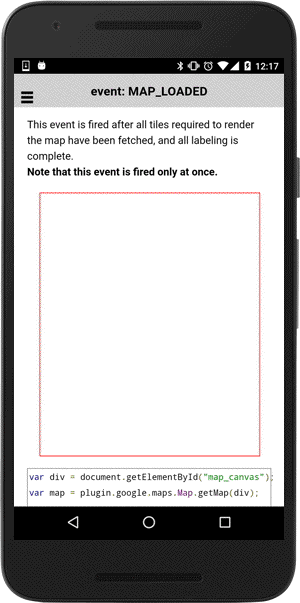

:warning: **This document is aim for older versions (from 2.0.0 to 2.2.9).
Document for new version is https://github.com/mapsplugin/cordova-plugin-googlemaps-doc/blob/master/v2.6.0/README.md**

# MAP_LOADED event

This event is fired after all tiles required to render the map have been fetched, and all labeling is complete.

**Note that this event is fired only at once.**

```html
<div id="map_canvas"></div>
```

```js
var div = document.getElementById("map_canvas");
var map = plugin.google.maps.Map.getMap(div);

map.one(plugin.google.maps.event.MAP_READY, function() {

  map.on(plugin.google.maps.event.MAP_LOADED, function() {
    alert("Map tiles are loaded");
  });

});
```


