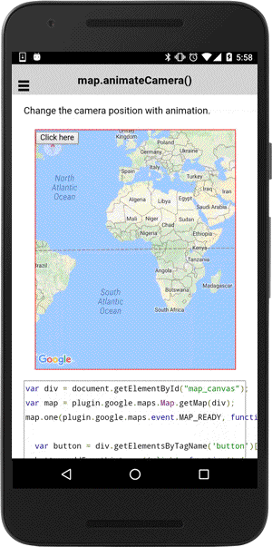

:warning: **This document is aim for older versions (from 2.0.0 to 2.2.9).
Document for new version is https://github.com/mapsplugin/cordova-plugin-googlemaps-doc/blob/master/v2.6.0/README.md**

# map.animateCamera()

You can change camera position with animation.

```html
<div class="map" id="map_canvas">
    <button>Click here</button>
</div>
```

```js
var div = document.getElementById("map_canvas");
var map = plugin.google.maps.Map.getMap(div);
map.one(plugin.google.maps.event.MAP_READY, function() {

  var button = div.getElementsByTagName('button')[0];
  button.addEventListener('click', function() {
    map.animateCamera({
      target: {lat: 37.422359, lng: -122.084344},
      zoom: 17,
      tilt: 60,
      bearing: 140,
      duration: 5000,
      padding: 0  // default = 20px
    }, function() {
      //alert("Camera target has been changed");
    });
  });

});
```


