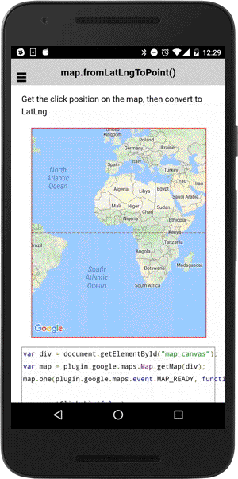

# map.fromPointToLatLng()

Convert the unit from the pixels from the left/top to the LatLng.

```html
<div class="map" id="map_canvas"></div>
```

```js
var div = document.getElementById("map_canvas");
var map = plugin.google.maps.Map.getMap(div);
map.one(plugin.google.maps.event.MAP_READY, function() {

  map.setClickable(false);

  div.addEventListener("click", function(e) {

    // Get the tapped position by pixels
    var clickX = e.pageX - this.offsetLeft;
    var clickY = e.pageY - this.offsetTop;

    // Convert point to LatLng.
    map.fromPointToLatLng([clickX, clickY], function(latLng) {

      // Add a marker
      map.addMarker({
        position: latLng,
        title: "Point: " + clickX + ", " + clickY
      }, function(marker) {
        marker.showInfoWindow();
      });
    });
  });

});
```


