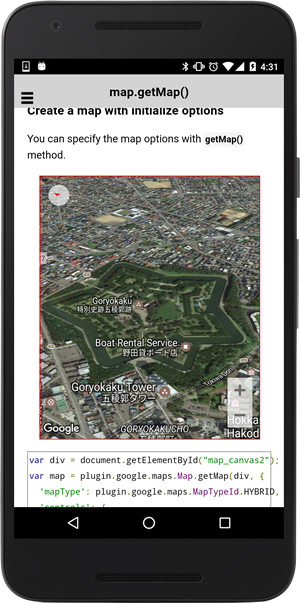

# plugin.google.maps.Map.getMap()

## Create a map

You can create a google maps using `plugin.google.maps.Map.getMap(div)`.

Since the cordova-plugin-googlemaps has two side: `JavaScript` and `native`.

The native side initialization takes a time kind of longer than JavaScript side, you need to wait the **plugin.google.maps.event.MAP_READY** event.

```html
<div style="width:500px;height:500px" id="map_canvas1"></div>
```

```javascript
var div = document.getElementById("map_canvas1");
var map = plugin.google.maps.Map.getMap(div);
map.one(plugin.google.maps.event.MAP_READY, function() {
  console.log("--> map_canvas1 : ready.");
});
```


## Create a map with initialize options

You can specify the map options with **getMap()** method.

Check out the available options at the [setOptions()](../setOptions/README.md) method.

```js
var div = document.getElementById("map_canvas2");
var map = plugin.google.maps.Map.getMap(div, {
  'mapType': plugin.google.maps.MapTypeId.ROADMAP,
  'controls': {
    'compass': true,
    //'myLocationButton': true,
    'indoorPicker': true,
    'zoom': true
  },
  'gestures': {
    'scroll': true,
    'tilt': true,
    'rotate': true,
    'zoom': true
  },
  'styles': [
    {
      featureType: "all",
      stylers: [
        { saturation: -80 }
      ]
    },{
      featureType: "road.arterial",
      elementType: "geometry",
      stylers: [
        { hue: "#00ffee" },
        { saturation: 50 }
      ]
    },{
      featureType: "poi.business",
      elementType: "labels",
      stylers: [
        { visibility: "off" }
      ]
    }
  ],
  'camera' : {
    target: {
      lat: 37.422375,
      lng: -122.084207
    },
    zoom: 10
  },
  'preferences': {
    'zoom': {
      'minZoom': 10,
      'maxZoom': 18
    },
    'building': false
  }
});
map.one(plugin.google.maps.event.MAP_READY, function() {
  console.log("--> map_canvas2 : ready.");
});
```




## Put any HTML elements on the map

The one of the benefits of the cordova-plugin-googlemaps is you are able to put any HTML elements on the map.

```html
<div class="map" id="map_canvas3" style="position:relative">
  <span class="smallPanel"><button>HTML button1</button></span>
  <span class="smallPanel" style="position:absolute;bottom:1em;right:1em;"><button>HTML button2</button></span>
</div>
```

```js
var div = document.getElementById("map_canvas3");
var map = plugin.google.maps.Map.getMap(div);
map.one(plugin.google.maps.event.MAP_READY, function() {
  console.log("--> map_canvas3 : ready.");
});
var button = div.getElementsByTagName('button')[0];
button.addEventListener('click', function() {
  alert("The HTML button1 on the map is clicked.");
});
var button = div.getElementsByTagName('button')[1];
button.addEventListener('click', function() {
  alert("The HTML button2 on the map is clicked.");
});
```


