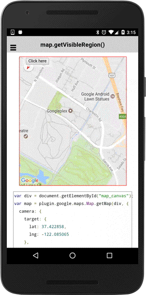

# map.getVisibleRegion()

**May/17/2017 changed**

This method returns the **visible region**.

The visible region contains these properties:

- nearLeft, nearRight, farLeft, and farRight
- latLngBounds


## nearLeft, nearRight, farLeft, and farRight

These are the latitude/longitude pairs of left-top(nearLeft), left-right(nearRight), left-bottom(farLeft) and right-bottom(farRight) of the current viewport.

## latLngBounds

A LatLngBounds that contains the above four points. Not equals with the four points when the map is rotated or has tilt.


In the below example, the blue rectangle represents the visible region, the red rectangle represents the viewport region.

This polygon can be a trapezoid instead of a rectangle, because a camera can have tilt. If the camera is directly over the center of the camera, the shape is rectangular, but if the camera is tilted, the shape will appear to be a trapezoid whose smallest side is closest to the point of view.


```js
var map = plugin.google.maps.Map.getMap(div, {
  camera: {
    target: {
      lat: 37.422858,
      lng: -122.085065
    },
    zoom: 15,
    bearing: 150
  }
});
map.one(plugin.google.maps.event.MAP_READY, function() {

  var button = div.getElementsByTagName('button')[0];
  button.addEventListener('click', function() {

    // Get the visible region (LatLngBounds of SouthWest and NorthEast)
    var latLngBounds = map.getVisibleRegion();
    map.addPolygon({
      'points': [
        latLngBounds.northeast,
        {lat: latLngBounds.northeast.lat, lng: latLngBounds.southwest.lng},
        latLngBounds.southwest,
        {lat: latLngBounds.southwest.lat, lng: latLngBounds.northeast.lng}
      ],
      'strokeColor' : 'blue',
      'strokeWidth': 2,
      'fillColor': 'transparent'
    });

    var mapDiv = map.getDiv();
    var batch1 = new plugin.google.maps.BaseArrayClass();
    batch1.push([0, 0]); //left-top
    batch1.push([mapDiv.offsetWidth, 0]); //right-top
    batch1.push([mapDiv.offsetWidth, mapDiv.offsetHeight]); //right-bottom
    batch1.push([0, mapDiv.offsetHeight]); //left-bottom

    batch1.map(function(point, cb) {
      map.fromPointToLatLng(point, cb);
    }, function(values) {
      map.addPolygon({
        'points': values,
        'strokeColor' : 'red',
        'strokeWidth': 2,
        'fillColor': 'rgba(255, 0, 0, 0.5)'
      });
    });

    map.animateCameraZoomOut();

  });

});
```


