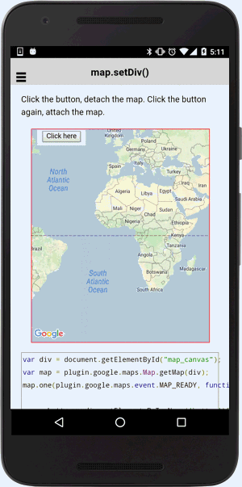

:warning: **This document is aim for older versions (from 2.0.0 to 2.2.9).
Document for new version is https://github.com/mapsplugin/cordova-plugin-googlemaps-doc/blob/master/v2.6.0/README.md**

# map.setDiv()

After creating a map, you can change the map div using `map.setDiv()`.

If you specify a new div, the map moves to the div.
If you specify `null`, the map is disappear (but the map is not destroyed yet).

The below code can attach / detach the map when you click the button on the map.

```html
<div class="map" id="map_canvas">
    <span class="smallPanel"><button>Click here</button></span>
</div>
```

```js
var div = document.getElementById("map_canvas");
var map = plugin.google.maps.Map.getMap(div);
map.one(plugin.google.maps.event.MAP_READY, function() {

  var button = div.getElementsByTagName('button')[0];
  button.addEventListener('click', function() {
    if (map.getDiv()) {
      map.setDiv();
    } else {
      map.setDiv(div);
    }
  });

});
```


