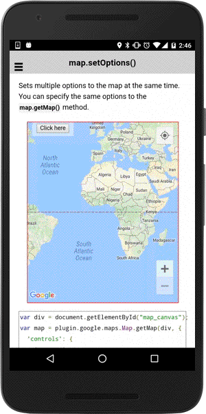

# map.setOptions()

Sets multiple options to the map at the same time. You can specify the same options to the `map.getMap()` method.

```html
<div class="map" id="map_canvas">
  <span class="smallPanel"><button>Click here</button></span>
</div>
```

```js
var div = document.getElementById("map_canvas");
var map = plugin.google.maps.Map.getMap(div, {
  'controls': {
    'compass': true,
    'myLocationButton': true,
    'indoorPicker': true,
    'zoom': true // Only for Android
  }
});
map.one(plugin.google.maps.event.MAP_READY, function() {

  var button = div.getElementsByTagName('button')[0];
  button.addEventListener('click', function() {

    // Change the map options
    map.setOptions({
      'mapType': plugin.google.maps.MapTypeId.HYBRID,
      'controls': {
        'compass': true,
        'myLocationButton': true,
        'indoorPicker': true,
        'zoom': true,
        'mapToolbar': true   // currently Android only
      },
      'gestures': {
        'scroll': true,
        'tilt': true,
        'rotate': true,
        'zoom': true
      },
      'camera': {
        'target': {
          lat: 37.422848,
          lng: -122.085565
        },
        'tilt': 30,
        'zoom': 15,
        'bearing': 50
      },
      'preferences': {
        'zoom': {
          'minZoom': 0,
          'maxZoom': 3
        },
        'padding': {
          'left': 30,
          'top': 50,
          'bottom': 20,
          'right': 10
        }
      }
    });

  });

});
```



------

## Custome styles

You can also change the map tile styles. More details, please check out the [google maps javascript api v3 document page](https://developers.google.com/maps/documentation/javascript/styling)

```html
<div class="map" id="map_canvas">
  <span class="smallPanel"><button>Change the style</button></span>
</div>

```html
var div = document.getElementById("map_canvas");

// Initialize the map view
var map = plugin.google.maps.Map.getMap(div, {
  'styles': [
    {
      featureType: "all",
      stylers: [
        { saturation: -80 }
      ]
    },{
      featureType: "road.arterial",
      elementType: "geometry",
      stylers: [
        { hue: "#00ffee" },
        { saturation: 50 }
      ]
    },{
      featureType: "poi.business",
      elementType: "labels",
      stylers: [
        { visibility: "off" }
      ]
    }
  ],
  'camera' : {
    target: {
      lat: 37.422375,
      lng: -122.084207
    },
    zoom: 18
  },
  'preferences': {
    'zoom': {
      'minZoom': 15,
      'maxZoom': 18
    },
    'building': false
  }
});

// Wait until the map is ready status.
map.addEventListener(plugin.google.maps.event.MAP_READY, onMapReady);

function onMapReady() {
  var button = document.getElementById("button");
  button.addEventListener("click", onBtnClick.bind(map), false);
}

function onBtnClick() {
  var map = this;
  map.setOptions({
    styles: [
        {
            "featureType": "water",
            "elementType": "geometry",
            "stylers": [
                {
                    "visibility": "on"
                },
                {
                    "color": "#aee2e0"
                }
            ]
        },
        {
            "featureType": "landscape",
            "elementType": "geometry.fill",
            "stylers": [
                {
                    "color": "#abce83"
                }
            ]
        },
        {
            "featureType": "poi",
            "elementType": "geometry.fill",
            "stylers": [
                {
                    "color": "#769E72"
                }
            ]
        },
        {
            "featureType": "poi",
            "elementType": "labels.text.fill",
            "stylers": [
                {
                    "color": "#7B8758"
                }
            ]
        },
        {
            "featureType": "poi",
            "elementType": "labels.text.stroke",
            "stylers": [
                {
                    "color": "#EBF4A4"
                }
            ]
        },
        {
            "featureType": "poi.park",
            "elementType": "geometry",
            "stylers": [
                {
                    "visibility": "simplified"
                },
                {
                    "color": "#8dab68"
                }
            ]
        },
        {
            "featureType": "road",
            "elementType": "geometry.fill",
            "stylers": [
                {
                    "visibility": "simplified"
                }
            ]
        },
        {
            "featureType": "road",
            "elementType": "labels.text.fill",
            "stylers": [
                {
                    "color": "#5B5B3F"
                }
            ]
        },
        {
            "featureType": "road",
            "elementType": "labels.text.stroke",
            "stylers": [
                {
                    "color": "#ABCE83"
                }
            ]
        },
        {
            "featureType": "road",
            "elementType": "labels.icon",
            "stylers": [
                {
                    "visibility": "off"
                }
            ]
        },
        {
            "featureType": "road.local",
            "elementType": "geometry",
            "stylers": [
                {
                    "color": "#A4C67D"
                }
            ]
        },
        {
            "featureType": "road.arterial",
            "elementType": "geometry",
            "stylers": [
                {
                    "color": "#9BBF72"
                }
            ]
        },
        {
            "featureType": "road.highway",
            "elementType": "geometry",
            "stylers": [
                {
                    "color": "#EBF4A4"
                }
            ]
        },
        {
            "featureType": "transit",
            "stylers": [
                {
                    "visibility": "off"
                }
            ]
        },
        {
            "featureType": "administrative",
            "elementType": "geometry.stroke",
            "stylers": [
                {
                    "visibility": "on"
                },
                {
                    "color": "#87ae79"
                }
            ]
        },
        {
            "featureType": "administrative",
            "elementType": "geometry.fill",
            "stylers": [
                {
                    "color": "#7f2200"
                },
                {
                    "visibility": "off"
                }
            ]
        },
        {
            "featureType": "administrative",
            "elementType": "labels.text.stroke",
            "stylers": [
                {
                    "color": "#ffffff"
                },
                {
                    "visibility": "on"
                },
                {
                    "weight": 4.1
                }
            ]
        },
        {
            "featureType": "administrative",
            "elementType": "labels.text.fill",
            "stylers": [
                {
                    "color": "#495421"
                }
            ]
        },
        {
            "featureType": "administrative.neighborhood",
            "elementType": "labels",
            "stylers": [
                {
                    "visibility": "off"
                }
            ]
        }
    ]
  });
}
```
