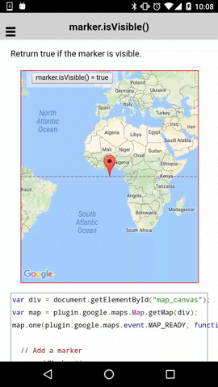

:warning: **This document is aim for older versions (from 2.0.0 to 2.2.9).
Document for new version is https://github.com/mapsplugin/cordova-plugin-googlemaps-doc/blob/master/v2.6.0/README.md**

# marker.isVisible()

Return true if the marker is visible.

```html
<div id="map_canvas">
  <span class="smallPanel"><button>marker.isVisible() = true</button></span>
</div>
```

```js
var div = document.getElementById("map_canvas");
var map = plugin.google.maps.Map.getMap(div);
map.one(plugin.google.maps.event.MAP_READY, function() {

  // Add a marker
  map.addMarker({
    'position': {
      lat: 0,
      lng: 0
    }
  }, function(marker) {

    var button = div.getElementsByTagName('button')[0];
    button.addEventListener("click", function() {
      if (marker.isVisible()) {
        marker.setVisible(false);
      } else{
        marker.setVisible(true);
      }
      button.innerHTML = "marker.isVisible() = " + marker.isVisible();
    });


  });
});
```


