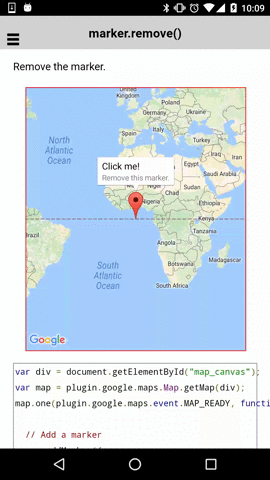

# marker.remove()

Remove the marker.

```html
<div id="map_canvas"></div>
```

```js
var div = document.getElementById("map_canvas");
var map = plugin.google.maps.Map.getMap(div);
map.one(plugin.google.maps.event.MAP_READY, function() {

  // Add a marker
  map.addMarker({
    'position': {
      lat: 0,
      lng: 0
    },
    'title': "Click me!",
    'snippet': 'Remove this marker.'
  }, function(marker) {

    // Open the infoWindow
    marker.showInfoWindow();

    // Catch the MARKER_CLICK event
    marker.on(plugin.google.maps.event.INFO_CLICK, function() {

      // Remove the marker.
      marker.remove();

    });
  });
});
```


