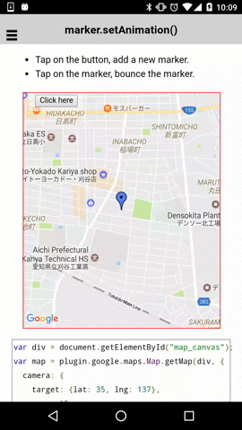

# marker.setAnimation()

You can give an animation to the marker.

Available animations are:
- plugin.google.maps.Animation.DROP
- plugin.google.maps.Animation.BOUNCE

```html
<div id="map_canvas">
    <span class="smallPanel"><button>Click here</button></span>
</div>
```

```js
var div = document.getElementById("map_canvas");
var map = plugin.google.maps.Map.getMap(div, {
  camera: {
    target: {lat: 35, lng: 137},
    zoom: 15
  }
});
map.one(plugin.google.maps.event.MAP_READY, function() {


  map.addMarker({
    position: new plugin.google.maps.LatLng(35, 137),
    icon: "http://www.google.com/intl/en_us/mapfiles/ms/icons/blue-dot.png",
    animation: plugin.google.maps.Animation.DROP
  }, function(marker) {

    var button = div.getElementsByTagName('button')[0];
    button.addEventListener("click", function() {
      marker.setAnimation(plugin.google.maps.Animation.DROP);
    });

    marker.on(plugin.google.maps.event.MARKER_CLICK, function() {
      marker.setAnimation(plugin.google.maps.Animation.BOUNCE);
    });
  });

});
```


